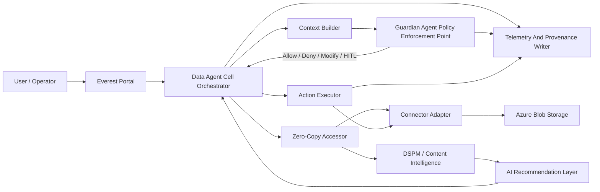

# Everest Azure Blob Architecture Review

## Review Purpose

This document compares the current Everest Azure Blob implementation by me with the team-proposed Data Agent Cell and DSPM policy enforcement architecture.

The goal is to identify what is wrong or incomplete in the current implementation, clarify architectural decisions, and agree on the target design before producing the final architecture PNG or animated GIF for team presentation.

## Executive Summary

The current Everest implementation by me is feature-rich, but it is not yet fully aligned with the team architecture at the invariant level.

The strongest gap is that the current product is still portal/API-handler driven, while the proposed architecture is orchestrator-first. In the target design, every scan, read, recommendation, and mutation should enter through one Data Agent Cell Orchestrator path. The orchestrator should build context, request a Guardian decision, enforce obligations, execute through connector adapters, and write tamper-evident provenance.

The current implementation has many important pieces:

- Azure Blob source setup
- Workbench operations
- DSPM/content intelligence concepts
- AI recommendations
- HITL approval flow
- Evidence Center
- Connector catalog
- Deployment mode support

However, these pieces are not yet governed by one hard runtime contract.

## Team Architecture Interpretation

The attached team architecture appears to define Everest around these principles:

1. Data Agent Cell is colocated near customer data.
2. The Orchestrator is the single control point.
3. All component communication goes through the Orchestrator.
4. Guardian Agent is the mandatory policy enforcement point.
5. No action proceeds without Guardian authorization.
6. Data access is zero-copy by default.
7. Connectors read by reference, handle, stream, cursor, or range.
8. Executors operate on data without creating unnecessary full copies.
9. Telemetry and provenance are recorded for every decision.
10. Policy is centrally authored, compiled, signed, distributed, and locally enforced.

## Current Implementation Assessment

| Area | Current Implementation | Target Architecture | Gap |
|---|---|---|---|
| Control model | Multiple portal/API flows drive behavior | Orchestrator is the single runtime entry point | Current control path is fragmented |
| Policy enforcement | Guardian/HITL exists, but not proven mandatory for every mutation | Guardian must authorize every action | Need hard enforcement boundary |
| Zero-copy | Supports previews, downloads, content payloads, and object operations | Read by handle/stream/range, no full persistent data copies | Need precise zero-copy contract |
| Connector model | Azure Blob Workbench is central | Connector-agnostic adapter model | Azure Blob logic should sit behind connector contract |
| Async jobs | Async scan jobs and checkpoints exist | No external queues, orchestrator-managed state | Need clarify state machine vs queue semantics |
| Provenance | Evidence and audit records exist | Tamper-evident decision records with policy version/hash | Provenance needs stronger integrity model |
| Policy lifecycle | Governance routes and policy context exist | Author, compile, sign, distribute, enforce | Missing signed policy bundle pipeline |
| AI involvement | AI recommends and prepares actions | AI bounded by evidence, policy, HITL, Guardian | Need explicit AI execution boundary |
| UI model | Many operational screens | Simple guided enterprise workflow | Need stronger progressive disclosure |
| Test strategy | Build and API tests exist | Invariant tests prove no bypass | Need architecture-level enforcement tests |

## Key Disagreements To Resolve

### 1. What Does Zero-Copy Mean?

Strict zero-copy is difficult across all Azure SDK and file scenarios because SDKs may buffer data.

Recommended definition:

Everest does not create persistent duplicate full-object copies by default. It accesses customer content by reference, stream, cursor, range, or bounded preview. Full content export/download requires explicit user action and audit.

### 2. What Does No Queues Mean?

Recommended definition:

No external queue or pub/sub bus is required for the core control path. The Orchestrator may maintain durable execution state, checkpoints, leases, and retries for large scans and recoverable operations.

### 3. Where Does Guardian Run?

Recommended definition:

Guardian enforcement runs inside or beside the Data Agent Cell as the local policy enforcement point. Policy authoring, compilation, and signed bundle distribution may be centralized.

### 4. What Can AI Do?

Recommended definition:

AI can summarize, classify, recommend, prepare metadata/tags, explain policy, and prefill HITL requests. AI cannot execute write, tier, move, quarantine, archive, or delete actions without Orchestrator and Guardian authorization.

## Recommended Target Architecture

The final architecture should use this runtime path:



## Required Architectural Invariants

These invariants should be treated as non-negotiable:

1. Portal cannot directly execute connector mutations.
2. AI cannot directly execute connector mutations.
3. Workbench cannot directly bypass Orchestrator.
4. Orchestrator cannot dispatch mutation without Guardian decision.
5. Guardian decision must include policy version and obligations.
6. Executor must enforce Guardian obligations.
7. Every decision must produce provenance.
8. Every mutation attempt must produce audit evidence, including blocked attempts.
9. Secrets are write-only from UI perspective.
10. Raw customer content is not persisted by default.
11. Connector adapters operate through a common contract.
12. Azure Blob is one connector implementation, not the product architecture.

## Recommended Implementation Refactor

### Phase 1: Contract Alignment

- Introduce `ActionRequestEnvelope`.
- Introduce `OrchestratorDecision`.
- Introduce `GuardianDecision`.
- Introduce `ActionReceipt`.
- Introduce `ProvenanceRecord`.
- Route Workbench operations through Orchestrator contract.

### Phase 2: Enforcement Boundary

- Require Guardian decision before all mutating operations.
- Add backend tests that prove denied actions cannot execute.
- Add tests that prove AI and Workbench cannot bypass Guardian.

### Phase 3: Zero-Copy Contract

- Define allowed content access modes:
  - metadata only
  - handle/reference
  - stream
  - range
  - bounded preview
  - explicit download/export
- Add audit event for any explicit content download/export.

### Phase 4: Provenance Hardening

- Add policy bundle version/hash to every decision.
- Add action receipt hash.
- Add tamper-evident record chaining or signature.
- Show provenance summary in Evidence Center.

### Phase 5: UI Simplification

- Default customer path:
  - Dashboard
  - Source
  - Scan
  - Recommendation
  - Approval
  - Evidence
- Move expert Workbench, raw support data, connector contracts, and diagnostics behind advanced/support surfaces.

## Decisions Requested 

1. Should the Orchestrator become the mandatory runtime entry point for every scan, read, AI recommendation, and action?
2. Should Workbench be repositioned as an advanced/expert tool rather than the primary customer journey?
3. What exact definition of zero-copy should Everest commit to?
4. Is orchestrator-managed durable execution state acceptable under the "no queues" principle?
5. Should every Guardian decision require policy bundle version/hash before execution?
6. Should AI be formally restricted to recommend, explain, classify, and prefill HITL only?
7. Should Azure Blob-specific UI be refactored behind a generic connector workbench contract?

## Conclusion

The current implementation should not be discarded. It has useful product capability and a strong Azure Blob vertical slice.

However, before calling it enterprise architecture-complete, Everest should be realigned around one enforced runtime path:

```text
Portal -> Data Agent Cell Orchestrator -> Guardian Decision -> Zero-Copy Accessor / Action Executor -> Provenance
```

All five review perspectives would support this conclusion:

- Keep the current Azure Blob capabilities.
- Refactor control flow around the Orchestrator.
- Make Guardian enforcement mandatory.
- Define zero-copy precisely.
- Harden provenance.
- Simplify the customer-facing UI around the governed journey.

