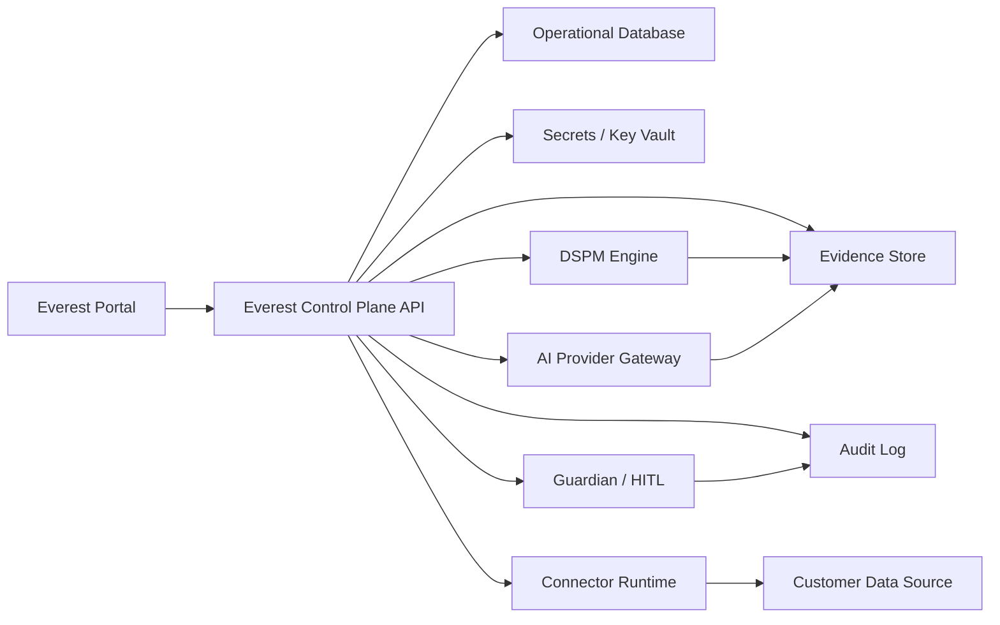
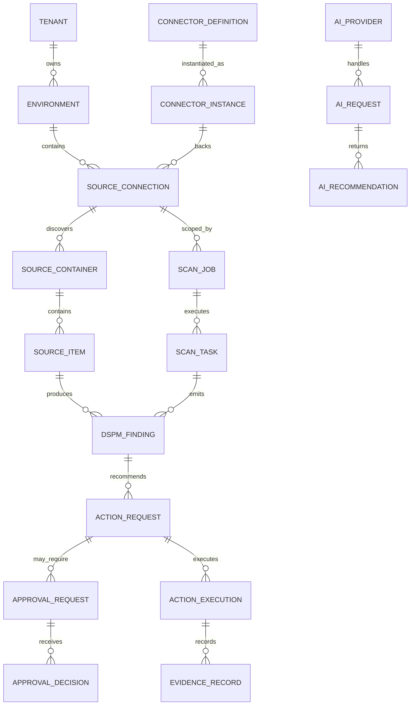
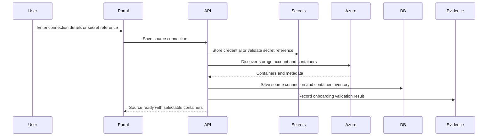
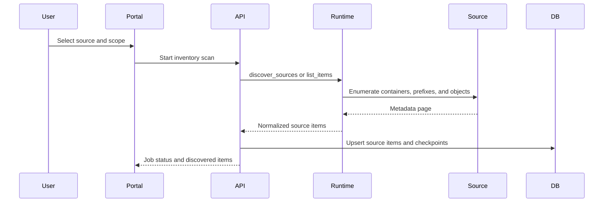
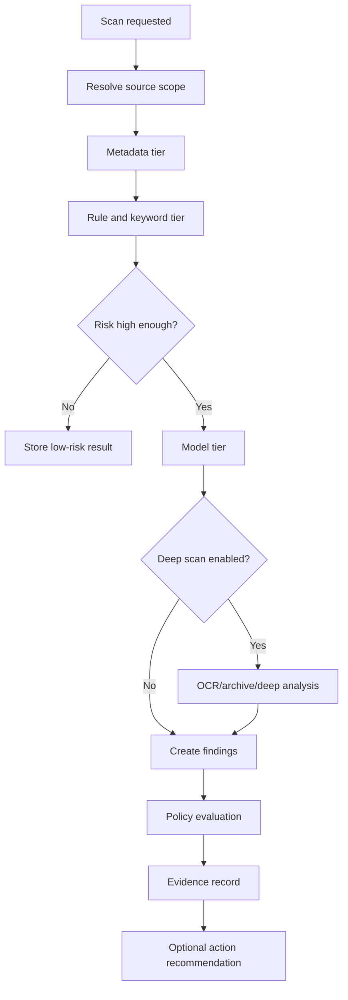
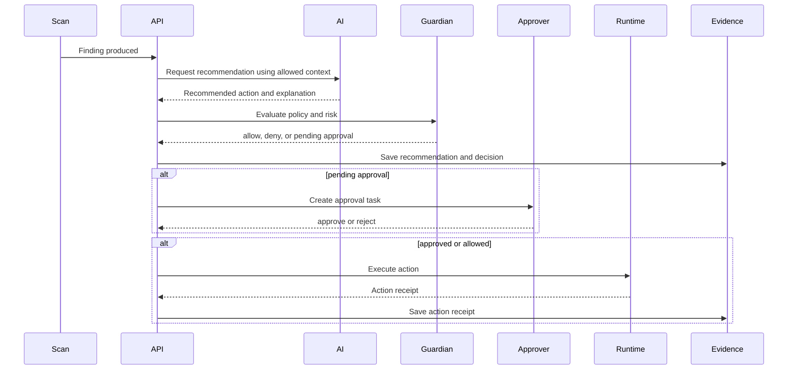
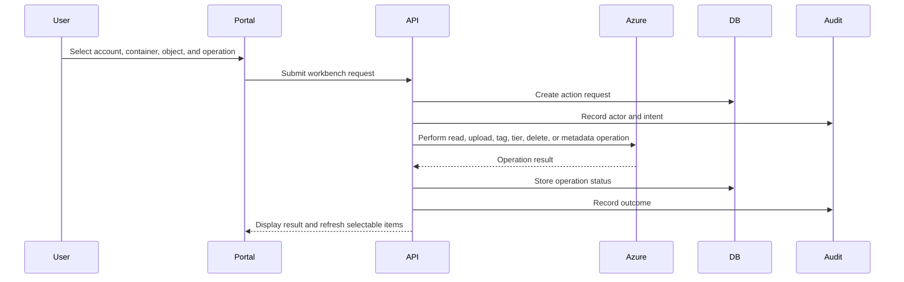

# Everest Database And Data Flow Engineering Guide

## Purpose

This document explains how Everest should model, store, move, and audit data across the portal, control plane, connector runtimes, Azure Blob operations, DSPM scans, AI tools, Guardian/HITL approvals, and evidence workflows.

It is written for engineers and testers who need to understand the product without relying on prior conversations.

## Current Implementation Posture

Everest currently behaves like an enterprise control plane with a local development runtime:

- The web portal drives operations from `web/index.html`.
- Backend APIs live under `internal/api`.
- Azure Blob Workbench, DSPM, AI provider, connector runtime, evidence, policy, and action flows are exposed as API-backed modules.
- Some data is currently sample-backed, config-backed, in-memory, or dry-run oriented.
- The sample plugin runtime exposes connector and AI endpoints for local testing.
- Azure Blob real-environment testing is supported through dedicated UI and tooling, but full enterprise persistence is still a target architecture item.

The enterprise product should move toward durable persistence, auditability, multi-tenant isolation, deployment-mode awareness, and connector-neutral data contracts.

## Design Principles

- Store customer data references, metadata, decisions, and evidence separately from raw content.
- Keep secrets out of the main operational database. Store only secret references.
- Make every connector follow the same source, item, scan, action, evidence, and policy model.
- Treat AI as advisory by default. Autonomous action requires explicit policy and Guardian approval behavior.
- Every mutating operation should have an idempotency key, actor, reason, policy decision, and audit trail.
- Air-gapped and private-network deployments must work without SaaS dependencies.
- Evidence must be reproducible enough for audit without over-retaining sensitive content.

## Logical Architecture



## Recommended Storage Layers

| Layer | Purpose | Example Data | Enterprise Requirement |
| --- | --- | --- | --- |
| Operational database | Product state and relationships | sources, scans, jobs, policies, approvals, provider configs | transactional, tenant-isolated, backed up |
| Evidence store | Scan outputs and audit artifacts | sampled metadata, findings, reports, action receipts | immutable or append-only preferred |
| Audit log | Who did what, when, and why | login, action request, approval, provider invocation | tamper-evident, searchable |
| Secrets store | Credentials and API keys | Azure connection string, SAS token, private LLM token | encrypted, rotated, never shown after save |
| Object staging store | Temporary files and larger outputs | scan exports, evidence bundles, connector payloads | lifecycle-managed |
| Semantic/vector store | Optional model features | embeddings, content fingerprints, entity links | deployment-mode aware |
| Event stream | Async workflows | scan requested, approval created, action completed | replayable or durable queue-backed |

## Core Data Domains

### Tenant And Environment

Represents a customer account and its deployment environment.

Primary entities:

- `tenant`
- `environment`
- `user`
- `role_assignment`
- `deployment_mode`

Important fields:

| Field | Meaning |
| --- | --- |
| `tenant_id` | Customer boundary for all data |
| `environment_id` | Specific cloud, private, hybrid, or air-gapped environment |
| `deployment_mode` | `cloud_connected`, `private_network`, `air_gapped`, `hybrid`, or `local_dev` |
| `data_boundary` | Describes where content, prompts, evidence, and AI calls may flow |
| `created_by` | User or service that created the record |

### Connector Catalog

Represents connector definitions, built-in connectors, planned connectors, and customer-owned custom connectors.

Primary entities:

- `connector_definition`
- `connector_runtime_manifest`
- `connector_instance`
- `connector_action`
- `connector_capability`

Important fields:

| Field | Meaning |
| --- | --- |
| `connector_type` | Example: `azure_blob`, `s3`, `nfs`, `sharepoint`, `custom` |
| `runtime_kind` | `builtin`, `http`, `external_process`, `plugin`, `customer_manifest` |
| `manifest_version` | Contract version supported by the runtime |
| `capabilities` | Discover, scan, classify, tag, delete, archive, restore, etc. |
| `air_gapped_supported` | Whether connector can run with no internet |
| `customer_code_allowed` | Whether customer-provided connector code is supported |

### Source Inventory

Represents configured customer data sources and discovered data containers.

Primary entities:

- `source_connection`
- `source_container`
- `source_item`
- `source_item_version`
- `source_permission`
- `source_metadata_snapshot`

For Azure Blob, this maps to:

| Everest Entity | Azure Blob Concept |
| --- | --- |
| `source_connection` | Storage account connection |
| `source_container` | Blob container |
| `source_item` | Blob object |
| `source_item_version` | Version or snapshot, when available |
| `source_permission` | Account, container, SAS, RBAC, ACL, or inherited access metadata |

### Scans And Jobs

Represents scheduled or user-triggered operations.

Primary entities:

- `scan_job`
- `scan_task`
- `job_run`
- `job_schedule`
- `job_checkpoint`
- `job_artifact`

Important fields:

| Field | Meaning |
| --- | --- |
| `job_type` | `inventory`, `metadata_scan`, `content_scan`, `tiered_content_scan`, `dspm_scan`, `action_execution` |
| `status` | `queued`, `running`, `completed`, `failed`, `cancelled`, `pending_approval` |
| `scope` | Source, container, prefix, selected item, policy, or saved query |
| `dry_run` | Whether the job can change customer data |
| `checkpoint` | Resume position for long scans |
| `retry_count` | Number of execution attempts |

### DSPM And Content Intelligence

Represents content findings, classification, entities, keyword matches, and model outputs.

Primary entities:

- `dspm_scan_profile`
- `content_scan_result`
- `dspm_finding`
- `entity_detection`
- `keyword_pattern`
- `model_profile`
- `risk_score`

Finding types should include:

- Secret exposure
- PII
- PHI
- PCI
- Financial data
- Legal or contract data
- Intellectual property
- Source code and credential material
- Customer-defined keyword patterns
- Policy violations
- Overexposed sensitive objects

Recommended scan tiers:

| Tier | Description | Typical Use |
| --- | --- | --- |
| Metadata | File names, paths, tags, sizes, owners, timestamps | fast inventory and prioritization |
| Rule | Regex, keyword packs, exact and fuzzy patterns | deterministic checks |
| Model | BERT or domain model classification | semantic classification |
| Deep | OCR, archive expansion, multi-pass analysis | high-risk or targeted review |

### AI Tools

Represents configured AI providers, runtime requests, and AI-assisted recommendations.

Primary entities:

- `ai_provider`
- `ai_runtime_policy`
- `ai_prompt_template`
- `ai_request`
- `ai_response`
- `ai_recommendation`
- `ai_safety_check`

Important fields:

| Field | Meaning |
| --- | --- |
| `provider_type` | `local_policy_copilot`, `private_llm_gateway`, `openai_compatible`, `custom_http`, etc. |
| `deployment_boundary` | `cloud_connected`, `private_network`, `air_gapped`, `local_or_air_gapped` |
| `prompt_sent` | Whether content or metadata was sent to the model |
| `content_redaction_mode` | `metadata_only`, `redacted_excerpt`, `full_content_allowed` |
| `autonomous_apply_allowed` | Whether AI can execute without approval |
| `hitl_required` | Whether human approval is mandatory |

### Guardian, HITL, And Actions

Represents action decisions and approvals before customer data is changed.

Primary entities:

- `action_request`
- `action_plan`
- `policy_decision`
- `approval_request`
- `approval_decision`
- `action_execution`
- `rollback_plan`

Important fields:

| Field | Meaning |
| --- | --- |
| `action_id` | Example: `tag_blob`, `archive_blob`, `delete_blob`, `quarantine`, `change_tier` |
| `requested_by` | Human, AI, policy, schedule, or external API |
| `risk_level` | `low`, `medium`, `high`, `critical` |
| `guardian_decision` | `allow`, `deny`, `pending`, `manual_review` |
| `approval_status` | `not_required`, `pending`, `approved`, `rejected`, `expired` |
| `confirmation_phrase` | Required phrase for destructive actions |

### Evidence Center

Represents audit-ready records that explain scan and action outcomes.

Primary entities:

- `evidence_record`
- `evidence_artifact`
- `evidence_bundle`
- `evidence_link`
- `retention_policy`

Evidence should answer:

- What was scanned?
- What was found?
- Which policy matched?
- Which AI or model helped?
- What action was recommended?
- Who approved or rejected it?
- What changed in the customer environment?
- How can the result be reproduced or reviewed?

## Logical Entity Relationship



## End To End Data Flows

### 1. Azure Blob Source Onboarding



Recommended behavior:

- If only a connection string is supplied, the portal should discover containers.
- If the storage account is reachable but no containers are listed, show permission and firewall guidance.
- If a container is supplied, validate it directly and still offer discovery when permissions allow.
- Never display the full connection string after save.

### 2. Source Inventory Discovery



Data rules:

- Use stable external IDs, such as account/container/blob/version.
- Store continuation tokens only as encrypted or internal job checkpoints.
- Upsert by tenant, source, item external ID, and version.
- Do not mark missing items as deleted until a full scan completes.

### 3. Tiered Content Scan



Data rules:

- Store scan profile and tier used for each result.
- Store exact keyword pattern IDs that matched.
- Store entity type, confidence, location hint, and redaction status.
- Avoid storing full sensitive content unless customer policy explicitly allows it.
- For model scans, store model profile, version, confidence, and explanation summary.

### 4. AI Recommendation With HITL



Data rules:

- AI recommendations must be stored separately from policy decisions.
- An AI recommendation is not an approval.
- High-risk and destructive actions should default to pending HITL.
- Store the prompt boundary, not necessarily the full prompt, when sensitive content is restricted.

### 5. Azure Blob Workbench Operation



Recommended operations:

- List containers
- List blobs
- View metadata and tags
- Upload test object
- Download or preview safe text content
- Update metadata
- Update tags
- Change access tier
- Copy or move object
- Delete object with confirmation and approval policy
- Restore from soft delete or version, when enabled

## Suggested Operational Database Tables

| Table | Purpose | Key Fields |
| --- | --- | --- |
| `tenants` | Customer boundary | `tenant_id`, `name`, `status` |
| `environments` | Deployment instance | `environment_id`, `tenant_id`, `mode`, `region`, `data_boundary` |
| `users` | Human users | `user_id`, `tenant_id`, `email`, `status` |
| `role_assignments` | RBAC mapping | `role_id`, `user_id`, `scope`, `permissions` |
| `connector_definitions` | Catalog entries | `connector_id`, `type`, `runtime_kind`, `manifest_version` |
| `connector_instances` | Configured runtime instances | `instance_id`, `connector_id`, `endpoint`, `status` |
| `source_connections` | Customer source configs | `source_id`, `connector_instance_id`, `credential_ref`, `status` |
| `source_containers` | Discovered containers | `container_id`, `source_id`, `name`, `metadata_hash` |
| `source_items` | Discovered objects | `item_id`, `container_id`, `external_id`, `path`, `size`, `etag` |
| `source_item_versions` | Object versions | `version_id`, `item_id`, `external_version`, `is_current` |
| `scan_jobs` | Scan definitions | `job_id`, `source_id`, `job_type`, `scope`, `status` |
| `scan_tasks` | Work units | `task_id`, `job_id`, `item_id`, `status`, `checkpoint` |
| `dspm_findings` | Security/privacy findings | `finding_id`, `item_id`, `type`, `severity`, `confidence` |
| `entity_detections` | Extracted entities | `entity_id`, `finding_id`, `entity_type`, `confidence`, `redacted_value` |
| `keyword_patterns` | Built-in or custom patterns | `pattern_id`, `tenant_id`, `name`, `pattern`, `enabled` |
| `policies` | Governance rules | `policy_id`, `tenant_id`, `name`, `effect`, `conditions` |
| `policy_decisions` | Policy outcomes | `decision_id`, `policy_id`, `resource_id`, `decision`, `reason` |
| `action_requests` | Requested changes | `request_id`, `action_id`, `target_id`, `status`, `risk_level` |
| `approval_requests` | HITL workflow | `approval_id`, `request_id`, `status`, `assigned_to`, `expires_at` |
| `approval_decisions` | Human decisions | `decision_id`, `approval_id`, `approver_id`, `decision`, `comment` |
| `action_executions` | Runtime execution receipts | `execution_id`, `request_id`, `status`, `receipt_ref` |
| `ai_providers` | AI runtime registry | `provider_id`, `type`, `deployment_boundary`, `status` |
| `ai_requests` | AI call records | `ai_request_id`, `provider_id`, `task`, `boundary`, `status` |
| `ai_recommendations` | AI outputs | `recommendation_id`, `ai_request_id`, `action`, `confidence` |
| `evidence_records` | Audit-ready facts | `evidence_id`, `subject_type`, `subject_id`, `artifact_ref` |
| `audit_events` | Append-only audit | `event_id`, `actor`, `event_type`, `target`, `created_at` |
| `job_artifacts` | Reports and exports | `artifact_id`, `job_id`, `artifact_type`, `storage_ref` |

## Event Model

Recommended event names:

| Event | Produced When | Primary Consumer |
| --- | --- | --- |
| `source.connection.created` | Source is configured | inventory worker |
| `source.discovery.completed` | Containers or items discovered | portal, evidence |
| `scan.job.requested` | User or schedule starts scan | scan worker |
| `scan.task.completed` | Item scan completes | DSPM/evidence |
| `dspm.finding.created` | Sensitive or risky content found | policy engine |
| `ai.recommendation.created` | AI suggests action | Guardian |
| `policy.decision.created` | Rule evaluation completes | action center |
| `approval.request.created` | HITL required | approver queue |
| `approval.decision.created` | Human decision entered | action executor |
| `action.execution.started` | Action begins | audit/evidence |
| `action.execution.completed` | Action succeeds or fails | portal/evidence |
| `evidence.record.created` | Evidence saved | evidence center |

Event requirements:

- Include `tenant_id`, `environment_id`, `correlation_id`, and `actor`.
- Include `idempotency_key` for mutating actions.
- Do not include secrets or full sensitive content.
- Use event replay only for idempotent or compensating workflows.

## Data Retention Guidance

| Data Type | Recommended Default | Notes |
| --- | --- | --- |
| Source metadata | 90 to 365 days | Customer configurable |
| Scan results | 90 to 365 days | Longer for regulated customers |
| Evidence records | 1 to 7 years | Depends on compliance posture |
| Audit events | 1 to 7 years | Should be tamper-evident |
| AI requests | 30 to 180 days | Store prompt boundary by default |
| Raw content samples | Disabled by default | Enable only by policy |
| Job logs | 30 to 90 days | Keep errors and receipts longer |
| Secrets | Until rotated or deleted | Never copied into evidence |

## Security And Privacy Requirements

- Encrypt operational database storage at rest.
- Encrypt all network traffic between portal, API, runtime, DB, and source.
- Use tenant-aware query filters in every persistence access path.
- Use row-level authorization where available.
- Store secret references, not secret values.
- Redact sensitive values in logs, evidence, AI prompts, and UI history.
- Require approval for destructive operations unless a policy explicitly allows automation.
- Require confirmation phrase for delete, purge, overwrite, and permission-changing operations.
- Keep AI provider data boundary visible to administrators.
- For air-gapped deployments, avoid any dependency on external telemetry, SaaS APIs, or hosted AI.

## Idempotency And Concurrency

Every mutating API should accept or create an idempotency key.

Recommended key format:

```text
tenant_id + action_id + target_external_id + requested_operation + request_timestamp_bucket
```

Concurrency rules:

- Use optimistic locking for source metadata and policy configuration.
- Use object ETag or version ID for Azure Blob updates when available.
- Do not execute delete or overwrite actions if the item changed after approval unless policy allows it.
- Keep action execution state separate from action request state.
- Record both attempted and completed operations.

## Azure Blob Data Mapping

| Azure Field | Everest Field | Notes |
| --- | --- | --- |
| Storage account name | `source_connection.external_name` | Avoid storing account key directly |
| Container name | `source_container.name` | Discoverable from connection string when permissions allow |
| Blob name | `source_item.path` | Preserve full virtual path |
| ETag | `source_item.etag` | Used for change detection |
| Content length | `source_item.size_bytes` | Useful for scan planning |
| Content type | `source_item.content_type` | Helps route parsers |
| Metadata | `source_item.metadata` | Store as normalized key/value JSON |
| Tags | `source_item.tags` | Governance and remediation target |
| Access tier | `source_item.storage_tier` | Hot, cool, cold, archive |
| Version ID | `source_item_version.external_version` | Required for safe restore |
| Last modified | `source_item.modified_at` | Inventory and delta scan |

## Air-Gapped Data Flow

Air-gapped deployments should use the same logical model with local replacements:

| Cloud Component | Air-Gapped Replacement |
| --- | --- |
| Hosted control plane | Customer-managed Everest control plane |
| Managed database | Customer-managed SQL/Postgres/approved DB |
| Cloud key vault | Customer-managed secrets vault |
| Hosted AI | Local model gateway or disabled AI |
| External connector runtime | Local connector runtime |
| SaaS telemetry | Local audit export |
| Online updates | Signed offline package import |

Air-gapped rules:

- No outbound internet required.
- AI providers must be local, disabled, or customer-approved.
- Connector manifests can be imported through signed packages.
- Evidence bundles must be exportable for offline review.
- Update and plugin package signatures must be verified locally.

## Migration Path From Current Local Product To Enterprise Persistence

Recommended implementation phases:

1. Introduce database interfaces behind existing API handlers.
2. Add durable storage for source connections, containers, workbench history, scan jobs, findings, AI provider configs, and approvals.
3. Add audit event writing for every mutating endpoint.
4. Add evidence record persistence for scan, AI, policy, and action outcomes.
5. Add RBAC and tenant/environment scoping.
6. Move long-running scan and action execution to background workers.
7. Add event queue for scan, approval, and action workflows.
8. Add migration scripts and controlled seed data for enterprise validation environments.
9. Add retention policies and evidence export.
10. Add deployment-mode configuration for cloud, private, hybrid, and air-gapped environments.

## Tester Notes

When testing persistence later, verify:

- Reloading the portal does not lose configured sources.
- Azure Blob Workbench history survives backend restart.
- AI provider configuration survives backend restart.
- Connector catalog custom manifests survive backend restart.
- Scan jobs can be resumed or clearly marked failed after restart.
- Evidence records are created for scan, AI recommendation, approval, and action execution.
- Audit events record actor, target, operation, result, and timestamp.
- Dry-run actions never mutate Azure Blob data.
- Destructive actions require confirmation and approval policy where expected.

## Developer Notes

Before adding a new module, define:

- Which tenant and environment own the data.
- Which database table or evidence artifact owns the state.
- Which event is emitted.
- Which API returns it to the UI.
- Whether it can run in air-gapped mode.
- Whether AI can access its data.
- Whether Guardian/HITL can block it.
- How it is audited.
- How it is cleaned up by retention policy.
