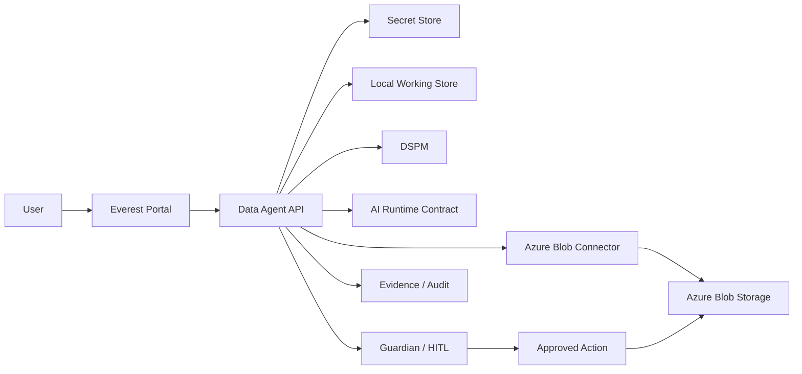
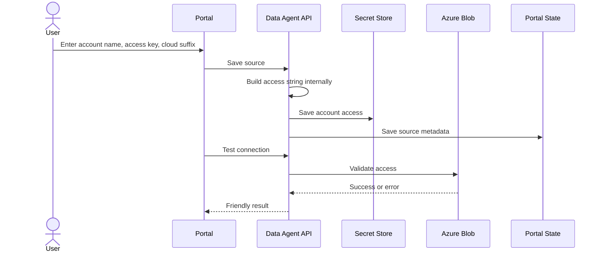

# Everest Demo Readiness Packet

Version: 2.0  
Date: June 2026  
Scope: Azure Blob enterprise demo, architecture discussion, UI validation, and safe test execution.

This is the single required demo packet. It consolidates architecture answers, flow explanation, UX guardrails, and positive/negative test scenarios.

## 1. Demo Positioning

Everest demonstrates a governed Azure Blob operating model:

1. Connect an Azure Blob source without exposing raw access strings to normal users.
2. Discover containers and objects.
3. Scan metadata and selected content signals.
4. Classify risk with DSPM rules and model-ready profiles.
5. Use AI for evidence-grounded recommendations.
6. Preview impact before apply.
7. Route risky actions through Guardian and HITL.
8. Apply approved safe changes.
9. Preserve evidence, provenance, approvals, and audit proof.

Safe statement:

Everest is Azure Blob first in this build, connector-neutral by architecture, and designed for cloud-connected, private-network, hybrid, and air-gapped deployments.

## 2. What We Can Confidently Show

- Simplified Azure Blob source setup using account name, access key, and cloud suffix.
- Saved source selection in Workbench.
- Per-source Azure Blob account access isolation for saved sources.
- Configurable secret provider posture: Windows Credential Manager by default, local file for air-gapped lab testing, environment-variable read-only for locked-down deployments, and enterprise vault contract modes.
- Container discovery and multi-container selection.
- List, view, create, update, download blob.
- Metadata and index tag operations.
- Copy, move-prep, tier, rehydrate, and delete guardrails.
- Dry-run versus apply behavior.
- DSPM keyword/rules classification.
- AI recommendation and editable action canvas.
- HITL/approval pattern.
- Evidence Center and audit-oriented outputs.
- Connector and AI provider manifest strategy.
- Day/night theme, alerts, support-only raw payloads.
- Animated Architecture Flow UI in the portal.
- Demo Assistant wizard for preview-first sample object, DSPM, tagging, and evidence flow.
- Demo Assistant run history, cleanup/reset controls, and audit/evidence recording.

## 3. What To Say Carefully

| Topic | Safe demo language |
| --- | --- |
| BERT / NER | Model profiles and contracts are represented; rules/keyword classification works now; full production model runtime integration is next. |
| Deep scan | Deep scan tier is part of the DSPM architecture; production background deep scan orchestration is next. |
| Postgres / Elasticsearch | Current demo uses local stores; enterprise target can use Postgres or approved DB and optional Elasticsearch/OpenSearch rollups. |
| Full RBAC | Current demo has role-aware UX and HITL roles; full enterprise identity/RBAC is planned. |
| Exabyte scale | Current slice proves contracts and controls; enterprise scale requires async jobs, checkpoints, queues, memory pools, and Agent Cell failover. |

## 4. Architecture Q&A

### 4.1 What operations is the user doing?

| Operation family | Current status | Demo answer |
| --- | --- | --- |
| Quick scan | Implemented through source validation, container discovery, list blobs, metadata scan. | Ready to show. |
| Classification | Implemented for rules/keyword/DSPM metadata and selected content signals. | Ready to show. |
| Sampling | Contract and UI scoping exist through prefixes, limits, and selected objects. | Explain as partial/current, full scheduler next. |
| Deep scan | UI tier and architecture exist. | Contract-ready; production async deep scan next. |
| Workbench actions | Implemented for list/view/create/update/metadata/tags/copy/move-prep/tier/rehydrate/download/delete. | Ready in test container. |
| AI/HITL | Implemented for local/evidence-grounded recommendations and approval flow. | Ready to show. |

### 4.2 How are operations performed?

1. User selects a source/scope/action in the portal.
2. Portal calls the Data Agent API.
3. Data Agent loads account access for the selected source from the secret store.
4. Azure Blob connector performs read, preview, or approved apply.
5. Working store receives normalized records.
6. DSPM/AI/Guardian use normalized evidence and bounded samples.
7. Evidence/audit records are created.
8. Portal shows friendly result and next action.

### 4.3 Where is information stored?

| Data | Current demo storage | Enterprise target |
| --- | --- | --- |
| Account access | Local secret store / Windows Credential Manager abstraction | Vault, Key Vault, K8s secret, or customer-approved secret manager |
| Source display metadata | Portal state store | Postgres/approved relational DB |
| Normalized scan records | DuckDB local working store | Local Agent Cell store plus central evidence index |
| Jobs/approvals | SQLite platform store when platform API runs | Postgres/approved DB |
| Evidence/audit | Local portal/platform records and export views | Append-only/tamper-evident evidence store |
| Raw blob content | Azure Blob source | Stays in customer source unless explicitly viewed/downloaded/approved copied |
| Search analytics | Not required for local demo | Optional Elasticsearch/OpenSearch rollup |

### 4.4 Who updates the DB?

| Component | Writes |
| --- | --- |
| Data Agent API | Source config, local runtime state, workbench results, evidence/action records. |
| Azure Blob scanner | Normalized metadata records. |
| Platform API | Jobs, approvals, governance context, summaries. |
| DSPM module | Classification findings, entities, recommended metadata/tags. |
| AI module | Recommendation rationale and action canvas records. |
| Guardian/HITL | Approval decisions, blocked/allowed status, action receipts. |

### 4.4A How are secrets handled across deployment modes?

Everest uses a secret-provider abstraction. Normal users never need to enter or view a raw connection string.

| Provider | Environment value | Writable from portal | Best use |
| --- | --- | --- | --- |
| Windows Credential Manager | `EVEREST_SECRET_PROVIDER=windows_credential_manager` | Yes | Windows demo, local enterprise workstation, default mode. |
| Local file | `EVEREST_SECRET_PROVIDER=local_file` | Yes | Air-gapped lab or isolated test environment. Use `EVEREST_SECRET_FILE_PATH` to choose the file. |
| Environment variables | `EVEREST_SECRET_PROVIDER=environment` | No | Locked-down deployment where operations pre-provision secrets outside the portal. |
| Azure Key Vault contract | `EVEREST_SECRET_PROVIDER=azure_key_vault` | No in this local build | Production adapter target. |
| HashiCorp Vault contract | `EVEREST_SECRET_PROVIDER=hashicorp_vault` | No in this local build | Private-network production adapter target. |
| Kubernetes Secret contract | `EVEREST_SECRET_PROVIDER=kubernetes_secret` | No in this local build | Containerized/cluster deployment adapter target. |

Environment provider secret names are built from the Everest secret path. Example:

`connectors/azureblob/connection_string` becomes `EVEREST_SECRET_CONNECTORS_AZUREBLOB_CONNECTION_STRING`.

Source-specific Azure Blob access uses the source secret path:

`connectors/azureblob/sources/<source-id>/connection_string`.

### 4.5 How does data science use scanned data?

Data science should consume governed features and evidence, not unrestricted raw files:

- object ID and source reference
- path, extension, size, content type
- metadata and index tags
- policy/risk labels
- sampled/redacted content where allowed
- entity findings and confidence
- model profile and rationale
- retention and data boundary

### 4.6 What NER/model profiles are supported?

| Profile | Current status | Use |
| --- | --- | --- |
| Built-in rules | Implemented | Deterministic keyword/entity checks. |
| Local BERT NER | UI/contract-ready | Air-gapped/private model runtime. |
| Domain BERT DSPM | UI/contract-ready | Customer/domain model. |
| Cloud language service | UI/contract-ready | Cloud-connected customers where policy allows. |

### 4.7 How are sensitive files/data handled?

- Raw support data is hidden unless requested.
- Access key is stored as secret, not shown in normal UI.
- Backend creates connection string internally.
- Each saved Azure Blob source stores account access under a source-specific secret; the legacy global secret is only a compatibility fallback.
- Workbench defaults to preview/dry-run.
- Destructive actions require confirmation text.
- Risky actions route to Guardian/HITL.
- AI recommendations are evidence-grounded and local in this build.
- Raw file content is not persistently copied by default.

### 4.8 Who has access to what?

Current demo has role-aware UX and HITL roles, not full production identity/RBAC.

Enterprise target:

| Role | Access |
| --- | --- |
| Data security analyst | Scans, workbench, DSPM findings, investigation views. |
| Data steward | Classification review and safe metadata/tagging. |
| CISO/risk leader | Dashboard, risk posture, sovereignty, compliance evidence. |
| Compliance/audit | Evidence, provenance, approvals, exports. |
| Platform admin | Sources, connectors, AI providers, deployment mode. |
| Approver | HITL decisions for risky/destructive actions. |
| Support engineer | Diagnostics/support data with audit. |

### 4.9 How are large numbers of files handled?

Current demo:

- limits and prefixes
- selected containers
- local normalized records
- dry-run for bulk-safety

Enterprise target:

- async scan jobs
- Azure paging cursors
- checkpoints by container/prefix/page
- idempotent writes
- retry-safe action receipts
- local spill-to-disk
- bounded memory pools
- backpressure on Azure/local store/model runtime

### 4.10 Temporary versus permanent storage

| Type | Examples | Retention |
| --- | --- | --- |
| Temporary | upload buffer, preview text, blob page result | short-lived |
| Working | DuckDB records, batch state, scan results | job/evidence lifecycle |
| Permanent | source records, approvals, evidence summaries, audit | customer retention |
| External source | Azure Blob object content | remains in source unless approved action changes it |

### 4.11 How is large data transferred?

Do not move large raw content through synchronous JSON APIs.

Use:

- JSON for metadata and control commands
- streaming for content preview/download
- object references for large handoff
- batch records for scan results
- redacted samples for AI/model input
- evidence bundles for exports

### 4.12 Sync versus async

| Sync | Async enterprise target |
| --- | --- |
| health check | large scan |
| save/test source | deep scan |
| limited list containers/blobs | model inference across many files |
| single object view | bulk metadata/tag apply |
| single action preview | large evidence export |

### 4.13 Where are we I/O or network bound?

| Operation | Main bottleneck |
| --- | --- |
| List containers/blobs | Azure network latency and paging |
| Metadata scan | Azure network plus local store writes |
| View/download blob | Azure network and browser download |
| Create/update blob | upload bandwidth and Azure write latency |
| Metadata/tags/tier | Azure API latency |
| DSPM rules | CPU/memory proportional to content size |
| BERT/model scan | model runtime, CPU/GPU, memory |
| Evidence export | local I/O and serialization |

### 4.14 Performance and memory strategy

Enterprise recommendations:

- streaming readers
- bounded max preview bytes
- object references instead of byte copies
- shared reusable memory buffers for content/deep scans
- strict buffer zeroing/redaction
- worker pools with tenant quotas
- Azure throttling/backpressure handling
- latency, throughput, retry, and memory metrics

### 4.15 What happens if an Agent Cell dies?

Current demo: in-flight sync operation may need rerun; already written local state remains.

Enterprise target:

- heartbeat detects loss
- lease expires
- another Agent Cell resumes from checkpoint
- idempotency prevents duplicate writes
- partial batches are marked incomplete
- evidence records interruption and recovery

### 4.16 How will cross-platform communication work?

Contract-first integration:

- connector manifest declares capabilities/actions/safety
- runtime request/response contract standardizes calls
- normalized object model hides source-specific details
- Guardian/HITL governs actions
- AI provider manifest standardizes model providers
- evidence contract records decisions and receipts

Runtime styles:

- built-in connector
- HTTP runtime
- local HTTP runtime
- external process
- plugin package
- customer-owned manifest/runtime

## 5. Architecture Flow

## 6. Source Setup Sequence

## 7. UX Principles

Everest functional screens should be calm, enterprise-grade, and low-friction.

Rules:

- user productivity first
- sovereign/professional trust
- brand accents only where useful
- tagging-first and guided
- shared components
- WCAG contrast
- architecture alignment with Agent Cell, Maestro, Guardian, HITL
- data visualization discipline

Palette rules:

- maximum 3-4 accent colors per functional screen
- dashboard/chart maximum 5-7 colors, ideally 4-6
- red/orange: high risk or blocked
- amber: warning/review
- green: success/compliant/safe
- blue: sovereignty/trust/local execution
- purple/gray: governance/provenance/neutral

UI audit checklist:

- no internal module names in customer UI
- no raw connection string in normal flow
- day/night readable
- notifications top-right and clearable
- destructive actions default to preview
- support data hidden until requested
- selected containers visible
- saved sources add/modify/remove/select
- evidence/export story clear

## 8. Fast Demo Script

1. Dashboard: show posture and next action.
2. Architecture Flow: show complete architecture, components, positive flow, negative flow.
3. Source Inventory: add/test Azure Blob source.
4. Discover containers: select containers and show chips.
5. Workbench: create demo blob in preview, then apply in test container.
6. Demo Assistant: run preview, then apply safe steps only in a test container.
7. View blob: show metadata/tags/preview.
8. DSPM: run rules scan and use recommended tags.
9. AI: generate recommendation/action canvas.
10. Action Center: show HITL/approval posture.
11. Evidence Center: show evidence/provenance/export story.

### Demo Assistant Flow

Use this when time is short or when the customer wants a single guided validation:

1. Open Azure Blob Workbench.
2. Enter or select a dedicated test container.
3. Keep mode as `Preview only`.
4. Click `Prepare Demo`.
5. Click `Run Preview`.
6. Review assistant progress and Workbench results.
7. Change mode to `Apply safe steps in test container` only if using a test container.
8. Click `Apply Safe Steps`.
9. Click `Generate Evidence`.
10. Use `Preview Cleanup` before deleting the demo-created blob.
11. Use `Cleanup Test Object` only for demo-created test objects.
12. Use `Reset Assistant` to restore preview mode and sample defaults.

Expected:

- Preview mode performs no Azure mutation.
- Apply mode creates or reuses the test container, creates a sample blob, runs DSPM, stages tags, applies safe tags, refreshes evidence, and returns preview mode to on.
- Evidence package download is requested from current portal records.
- Run history remains visible in the assistant panel.
- Guided steps are recorded as local audit/evidence events when the backend is available.
- Cleanup deletes only the selected demo blob; the test container is retained for reuse.

## 9. Positive Test Scenarios

### P1 Add Azure Blob Source

Steps:

1. Open Source Inventory.
2. Enter account name, access key, cloud suffix.
3. Save Source.
4. Test Connection.
5. Discover Containers.

Expected:

- Source saves.
- No connection string is requested.
- Account access is saved for that source ID.
- Runtime status shows the active secret provider without exposing secret values.
- Connection returns OK.
- Containers appear.
- Saved source appears in Workbench.

### P2 Select Multiple Containers

Steps:

1. Discover containers.
2. Select multiple checkboxes.
3. Use Selected Containers.

Expected:

- Selected-container summary appears.
- Chips show selected containers.
- Source, Onboarding, and Workbench scopes sync.

### P2A Switch Saved Azure Blob Source

Steps:

1. Add or select another saved Azure Blob source.
2. Open Azure Blob Workbench.
3. Pick that source from `Saved source`.
4. Click `Discover Containers` or `List blobs`.

Expected:

- Workbench sends the selected `source_id`.
- Backend uses source-specific saved account access.
- Workbench status shows `saved source access`.
- Containers/blobs populate for the selected source.

### P3 Create Test Container

Dry-run:

1. Workbench -> Create container.
2. Enter test container.
3. Keep preview first.
4. Run Operation.

Expected: no mutation.

Apply:

1. Clear preview first.
2. Run Operation.
3. Discover Containers.

Expected: container appears.

### P4 Create And View Demo Blob

Dry-run:

1. Create blob.
2. Enter blob path and sample text.
3. Keep preview first.
4. Run Operation.

Expected: preview only.

Apply:

1. Clear preview first.
2. Run Operation.
3. View blob.

Expected: details and preview visible.

### P5 List And Download Blob

Steps:

1. List blobs with prefix.
2. Use demo blob.
3. Download blob.
4. Download Result.

Expected:

- Blob listed.
- File downloads.
- No mutation.

### P6 Set Metadata And Tags

Dry-run:

1. Set metadata `owner=qa,purpose=demo`.
2. Keep preview first.
3. Run Operation.

Apply:

1. Clear preview first.
2. Run Operation.
3. Set tags `everest_test=true,classification=internal`.
4. Preview, then apply.
5. View blob.

Expected: metadata and tags visible.

### P7 DSPM Rules Scan

Steps:

1. Select demo blob.
2. Scan tier `rules`.
3. Model profile `Built-in rules`.
4. Run DSPM Scan.
5. Use DSPM Tags.

Expected:

- Classification, findings, recommended metadata/tags appear.
- Tags/metadata can be previewed and applied.

### P8 AI Recommendation

Steps:

1. Select blob.
2. Click Recommend Tags or Complete Metadata.
3. Review Action Canvas.
4. Apply Canvas To Form.
5. Preview operation.

Expected:

- AI recommendation has rationale.
- Safe action can be previewed.
- Risky action routes to HITL.

### P9 Copy Blob

Dry-run:

1. Select blob.
2. Click Copy.
3. Target same test container and copy prefix.
4. Keep preview first.
5. Run Operation.

Apply:

1. Clear preview first.
2. Run Operation.
3. List target prefix.

Expected: copied blob appears.

### P10 Tier Change Preview/Apply

Dry-run:

1. Select blob.
2. Click Tier.
3. Choose `cool`.
4. Keep preview first.
5. Run Operation.

Apply:

1. Clear preview first in test container.
2. Confirm if required.
3. Run Operation.

Expected: tier change requested/applied and evidence recorded.

## 10. Negative Test Scenarios

### N1 Invalid Access

Steps:

1. Enter wrong access key.
2. Save Source.
3. Test Connection.

Expected:

- Friendly failure.
- No raw secret displayed.
- Azure operations blocked.

### N2 Missing Container

Steps:

1. Clear container.
2. Select List blobs or Create blob.
3. Run Operation.

Expected:

- Required container validation.
- No mutation.

### N3 Delete Without Confirmation

Dry-run:

1. Select Delete blob.
2. Keep preview first.
3. Run Operation.

Expected: no deletion.

Apply:

1. Clear preview first.
2. Leave confirmation blank or wrong.
3. Run Operation.

Expected: delete blocked and blob still exists.

### N4 Invalid Metadata Or Tags

Steps:

1. Enter invalid metadata/tag format.
2. Preview first.
3. Try apply only in test container.

Expected:

- Validation or Azure error.
- Existing metadata/tags unchanged.

### N5 Non-Existing Blob

Steps:

1. Enter missing blob path.
2. View blob.
3. Try Download Result.

Expected:

- Not found/read error.
- No download payload.
- No mutation.

## 11. Demo Safety Rules

- Use a test container only.
- Keep preview/dry-run enabled first.
- Do not apply delete/archive to production data.
- Do not show raw account access.
- Do not claim full production model runtime or exabyte-scale orchestration is complete.
- Say "contract-ready" or "target architecture" for future connectors/model runtimes.

## 12. Next Engineering Actions After Demo

1. Add async scan/job orchestration with checkpoint/resume.
2. Add production identity/RBAC and role-based diagnostics visibility.
3. Implement model runtime adapter for local BERT/domain model.
4. Add performance telemetry and shared memory pool for content/deep scan workers.
5. Add production secret provider adapters for Key Vault, Vault, K8s secrets, and air-gapped customer vaults.
