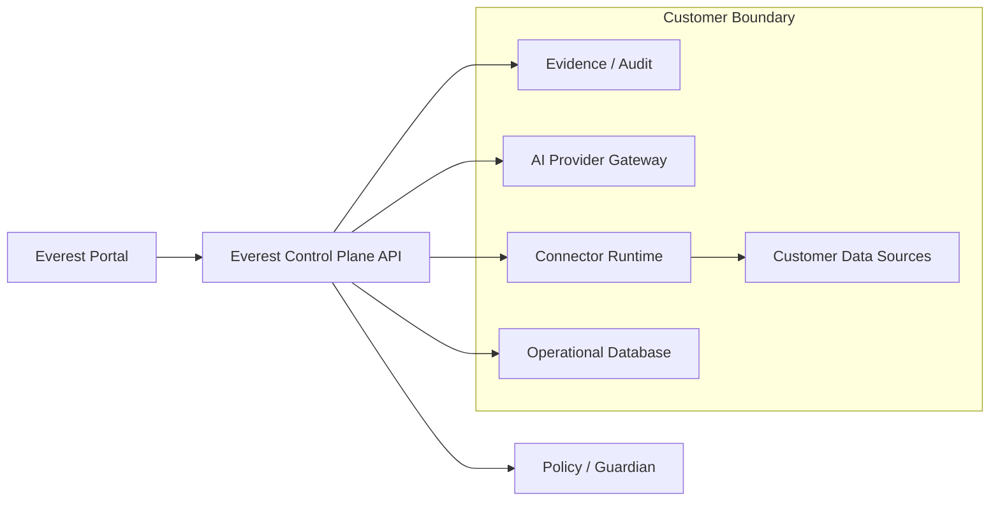
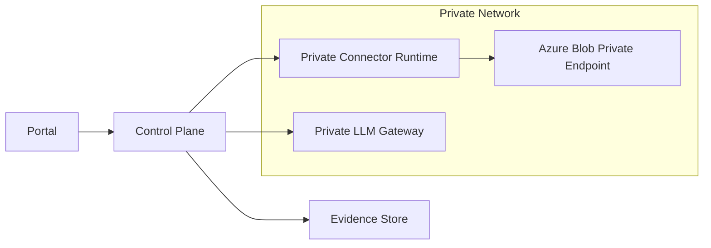
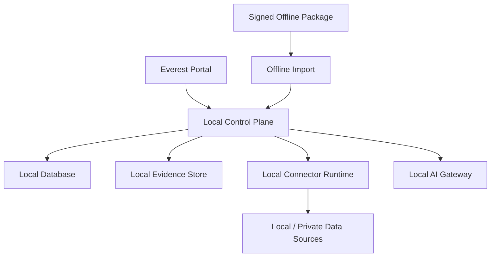
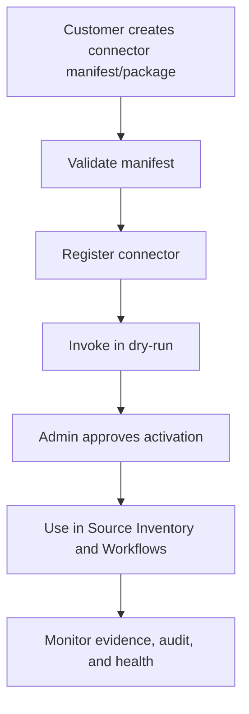

# Everest Deployment Modes Guide

## Purpose

This document defines how Everest should support different customer environments:

- Local demo and development
- Cloud-connected enterprise
- Private-network enterprise
- Air-gapped enterprise
- Hybrid enterprise
- Customer-owned custom connector deployments

The goal is to make Everest connector-neutral, AI-provider-neutral, and deployment-mode-aware from the beginning.

## Deployment Mode Summary

| Mode | Internet Required | Customer Data Boundary | AI Options | Connector Runtime | Typical Customer |
| --- | --- | --- | --- | --- | --- |
| Local demo/dev | Optional | Developer machine | sample/local | local process or built-in | engineering, demo |
| Cloud-connected | Yes | customer-approved cloud boundary | hosted or private | built-in, hosted, or customer runtime | SaaS-friendly enterprise |
| Private network | Limited | customer VNet/VPC/datacenter | private gateway or local | runtime inside private network | regulated enterprise |
| Air-gapped | No | fully customer-controlled | local only or disabled | local/offline runtime | defense, government, critical infra |
| Hybrid | Partial | split by source and policy | mixed by boundary | per-source runtime placement | large enterprise |
| Custom connector | Depends | customer-defined | optional | customer code, HTTP, plugin, external process | advanced customers and partners |

## Core Rule

Every feature should answer these questions before it is considered enterprise-ready:

- Can it run in cloud-connected mode?
- Can it run in private-network mode?
- Can it run in air-gapped mode?
- Does it require internet?
- Does it send prompts, metadata, or content to AI?
- Does it require a connector runtime?
- Does it support customer-owned connectors?
- Does Guardian/HITL protect risky actions?
- Does it produce evidence and audit records?

## Reference Architecture



In cloud-connected mode, some components may be hosted by Everest or customer-approved cloud services.

In private-network and air-gapped modes, runtime, AI, database, evidence, and source access should stay inside the customer boundary.

## Mode 1: Local Demo And Development

### Purpose

Used by developers, testers, and sales engineers to validate flows without a full enterprise deployment.

### Typical Characteristics

- Portal and backend run locally.
- Sample plugin runtime may run on `http://localhost:7071`.
- Mode often displays `dry_run`.
- Sample connector and AI endpoints can return mock or deterministic responses.
- Azure Blob Workbench may connect to a real Azure Blob endpoint when credentials are provided.

### Supported Workflows

- Source inventory demo
- Azure Blob Workbench testing
- Connector catalog and manifest validation
- AI provider configuration demo
- DSPM keyword and rule scan
- Guardian and HITL workflow demo
- Evidence UI review

### Requirements

| Area | Requirement |
| --- | --- |
| Secrets | Use local config, environment variables, or secret references for testing |
| Database | In-memory or local file is acceptable for demo, but not enterprise |
| AI | Local sample AI or customer private endpoint |
| Actions | Dry-run by default |
| Evidence | Demo evidence acceptable, but should clearly indicate sample data |

### Risks

- Users may confuse sample runtime with production runtime.
- Dry-run behavior may hide live-mode approval complexity.
- Local state may disappear after restart unless persistence is enabled.

### Recommended UI Indicator

Always show:

```text
Mode: dry_run
Runtime: local/demo
Data boundary: local
```

## Mode 2: Cloud-Connected Enterprise

### Purpose

Used by customers who allow Everest components to communicate with cloud APIs and approved AI or support services.

### Typical Characteristics

- Portal and control plane may run in customer cloud, managed cloud, or SaaS-approved environment.
- Connector runtime can be built-in or deployed near the data source.
- AI providers may include cloud LLMs, private gateways, or customer-approved endpoints.
- Online updates and hosted provider catalogs may be allowed.

### Supported Workflows

- Azure Blob discovery and operations
- Multi-connector source inventory
- DSPM scans with cloud or local models
- AI-assisted recommendations
- HITL approvals
- Scheduled jobs
- Evidence and audit export

### Network Requirements

| Component | Needs Access To |
| --- | --- |
| Portal | Control plane API |
| Control plane API | Database, evidence store, connector runtime, AI gateway |
| Connector runtime | Customer data source APIs |
| AI gateway | Configured AI provider |
| Evidence store | Control plane and scan/action workers |

### Security Requirements

- TLS for all service-to-service communication.
- Tenant isolation.
- RBAC.
- Secret references, not raw secrets in database.
- Audit logging for every mutating action.
- Configurable data boundary for AI.

### AI Guidance

Cloud-connected does not mean unrestricted AI.

AI provider configuration must define:

- Whether metadata only, redacted content, or full content may be sent.
- Whether prompts can leave customer network.
- Whether AI can recommend only or execute actions.
- Whether HITL is required.

## Mode 3: Private-Network Enterprise

### Purpose

Used by customers whose data sources are reachable only from a private VNet/VPC/datacenter network.

### Typical Characteristics

- Connector runtime runs inside the customer network.
- Control plane may be outside or inside the private network depending on policy.
- Private endpoint DNS, firewalls, and network routes matter.
- AI is usually customer private LLM gateway or local model service.

### Architecture



### Azure Blob Private Endpoint Notes

The connector runtime should be deployed where it can resolve and reach the Azure Blob private endpoint.

Check:

- Private DNS zone is configured.
- Runtime host resolves storage account to private IP.
- Firewall allows the runtime subnet.
- SAS/RBAC/account key has required permissions.
- No public endpoint dependency exists if customer disabled public access.

### Security Requirements

- Prefer managed identity or customer vault secret references.
- Do not send raw content outside private boundary unless explicitly allowed.
- AI provider boundary should default to private.
- Evidence should be stored in customer-approved location.

### Product Requirements

The UI should show:

- Runtime placement.
- Data boundary.
- AI provider boundary.
- Whether connector is private-network compatible.
- Whether source is reachable.

## Mode 4: Air-Gapped Enterprise

### Purpose

Used by customers with no internet access from the Everest environment.

### Typical Characteristics

- All services run inside customer-controlled infrastructure.
- No outbound calls to Everest SaaS, cloud AI, package registries, telemetry, or online update services.
- Connector packages, model packages, and updates are imported offline.
- AI is local only or disabled.

### Architecture



### Air-Gapped Hard Requirements

- No internet dependency.
- No hosted AI dependency.
- No hosted telemetry dependency.
- No online connector catalog dependency.
- No online license verification dependency unless customer approves controlled import.
- All update packages signed and verifiable offline.
- All custom connector packages signed or explicitly trusted by customer admin.
- Evidence export available as local bundle.

### AI Behavior

Allowed:

- Local policy copilot.
- Customer private LLM inside the air-gapped environment.
- Local BERT/domain models.
- Deterministic rule and keyword analysis.

Not allowed by default:

- Hosted LLM calls.
- Internet-based embeddings.
- External prompt logging.
- Remote model downloads at runtime.

### Connector Behavior

Allowed:

- Built-in connectors packaged with Everest.
- Customer-owned connector packages imported offline.
- HTTP runtimes reachable inside the air-gapped network.
- External process runtimes approved by customer admin.

Required:

- Manifest validation.
- Package signature or explicit trust workflow.
- Runtime sandbox policy.
- Audit log for connector import and activation.

### Update Strategy

Recommended offline update flow:

1. Everest publishes signed update package.
2. Customer downloads package on internet-connected staging machine.
3. Customer scans package with internal security process.
4. Customer transfers package to air-gapped environment.
5. Everest verifies signature locally.
6. Admin reviews release notes and compatibility.
7. Everest applies update and records audit event.

## Mode 5: Hybrid Enterprise

### Purpose

Used by large enterprises where some sources are cloud-connected, some are private, and some are restricted or air-gapped.

### Typical Characteristics

- Multiple connector runtimes.
- Per-source data boundary.
- Per-provider AI policy.
- Some actions can be automatic, while sensitive sources require HITL.
- Evidence and audit may be centralized or environment-specific.

### Example

| Source | Runtime | AI | Action Policy |
| --- | --- | --- | --- |
| Azure Blob public cloud | cloud runtime | approved cloud AI metadata-only | auto tag allowed |
| Azure Blob private endpoint | private runtime | private LLM | HITL for archive/delete |
| Legal archive | air-gapped runtime | local model only | manual review only |

### Product Requirements

- Every source must show its deployment boundary.
- Every AI provider must show compatible boundaries.
- Portal should prevent selecting an incompatible provider for a restricted source.
- Guardian must evaluate source boundary, action risk, and AI boundary together.

## Mode 6: Customer-Owned Custom Connector

### Purpose

Allows customers or partners to create connectors without waiting for Everest engineering to ship first-party connector support.

### Connector Runtime Types

| Runtime Type | Description | Best For |
| --- | --- | --- |
| Built-in | Compiled into Everest | first-party connectors |
| HTTP runtime | Customer-hosted service with Everest contract | enterprise custom connectors |
| External process | Local process invoked by Everest | air-gapped or local integrations |
| Plugin package | Signed package imported into Everest | partner/customer extensions |
| Manifest-only | Declarative connector contract | simple discovery/action adapters |

### Required Manifest Fields

| Field | Purpose |
| --- | --- |
| `connector_id` | Stable unique ID |
| `display_name` | Human-readable name |
| `manifest_version` | Contract version |
| `runtime_kind` | HTTP, external process, plugin, built-in |
| `endpoint` | Runtime endpoint or command reference |
| `capabilities` | Discover, scan, classify, tag, archive, delete, etc. |
| `actions` | Action IDs and schemas |
| `deployment_modes` | Supported modes |
| `data_boundary` | Where data can flow |
| `auth_schema` | Credential or secret reference requirements |
| `input_schema` | Request schema |
| `output_schema` | Response schema |
| `risk_profile` | Default action risk levels |

### Custom Connector Lifecycle



### Safety Requirements

- Custom connector actions must declare risk level.
- Destructive actions require confirmation and Guardian policy.
- Runtime must not receive secrets directly unless the deployment policy allows it.
- Runtime responses must be validated against output schema.
- Connector import must be audited.
- Customer code execution must be disabled unless explicitly allowed.

## AI Provider Deployment Matrix

| AI Provider Type | Cloud-Connected | Private Network | Air-Gapped | Notes |
| --- | --- | --- | --- | --- |
| Everest Local Policy Copilot | Yes | Yes | Yes | deterministic/local guidance |
| Customer Private LLM Gateway | Yes | Yes | Yes, if local | best enterprise default |
| OpenAI-compatible endpoint | Yes | Yes, if reachable | No, unless hosted locally | boundary must be explicit |
| Local BERT/domain model | Yes | Yes | Yes | requires local runtime integration |
| Disabled AI | Yes | Yes | Yes | deterministic mode only |

## Connector Deployment Matrix

| Connector Type | Cloud-Connected | Private Network | Air-Gapped | Notes |
| --- | --- | --- | --- | --- |
| Azure Blob Storage | Yes | Yes | Yes, if reachable through approved local/private path | supports real cloud or private endpoint |
| Amazon S3 | Yes | Yes | Possible with private-compatible endpoint | future connector |
| NFS/SMB | Via runtime | Yes | Yes | runtime must be inside network |
| SharePoint Online | Yes | Limited | No | internet/cloud identity dependency |
| OneDrive | Yes | Limited | No | internet/cloud identity dependency |
| Custom HTTP connector | Yes | Yes | Yes, if local | depends on endpoint placement |
| External process connector | Local only | Yes | Yes | admin trust required |

## Deployment Readiness Checklist

### For Every Deployment

- Portal URL configured.
- Control plane API reachable.
- Database configured.
- Evidence store configured.
- Audit log enabled.
- Secrets store configured.
- Default policies installed.
- Guardian/HITL enabled for high-risk actions.
- AI provider boundary configured.
- Connector runtime health visible.
- Dry-run mode validated.
- Live-mode approval path validated.

### For Azure Blob

- Connection method selected: connection string, SAS, managed identity, or secret reference.
- Container discovery validated.
- Blob listing validated.
- Metadata and tag read validated.
- Upload test object validated.
- Dry-run action validated.
- Live action validated only against safe test object.
- Soft delete/versioning behavior understood before destructive tests.

### For AI

- Provider selected.
- Data boundary approved.
- Prompt mode selected: metadata-only, redacted, or full content.
- Test provider succeeds.
- Recommendation stored in evidence.
- Autonomous apply policy confirmed.
- HITL path tested.

### For DSPM

- Scan tiers configured.
- Keyword packs selected.
- Custom keyword pattern validated.
- Model profile selected or disabled.
- Evidence generation verified.
- Findings visible in UI.

### For Custom Connectors

- Manifest validates.
- Runtime reachable.
- Dry-run invocation works.
- Action schemas are visible.
- Risk levels declared.
- Approval behavior tested.
- Evidence and audit records generated.

## Environment Configuration Guidance

Recommended configuration categories:

| Category | Example Settings |
| --- | --- |
| Portal | API base URL, theme default, deployment label |
| Control plane | mode, tenant ID, database URL, evidence store |
| Runtime | connector endpoint, allowed runtime kinds |
| AI | provider endpoint, prompt boundary, redaction policy |
| Security | auth provider, RBAC, secret store, TLS |
| Jobs | worker count, retry limits, timeout, checkpoint interval |
| Evidence | retention, export path, redaction mode |
| Audit | sink, retention, tamper-evidence mode |

## Testing Strategy By Mode

| Test Area | Local Demo | Cloud | Private | Air-Gapped | Hybrid |
| --- | --- | --- | --- | --- | --- |
| Portal health | required | required | required | required | required |
| Source discovery | sample and real | real | private endpoint | local/private | per source |
| AI provider | sample/local | approved cloud/private | private | local/disabled | per boundary |
| DSPM scan | sample content | real safe content | private content | local content | per source |
| Action dry-run | required | required | required | required | required |
| Live action | safe object only | safe object only | safe object only | safe object only | per source |
| HITL | required | required | required | required | required |
| Evidence | sample | production store | private store | local store | mixed |
| Offline update | not needed | optional | optional | required | optional |

## Product UX Requirements

The portal should make deployment mode visible and actionable:

- Show current mode in the header.
- Show data boundary on AI providers.
- Show connector deployment support in Connector Catalog.
- Block incompatible provider/source combinations.
- Prefer dropdowns populated from live discovered entities.
- Explain empty dropdowns with next steps.
- Make dry-run versus live mode impossible to miss.
- Place pending HITL actions in Action Center.
- Link scan/action results to Evidence Center.

## Enterprise Acceptance Criteria

Everest is deployment-mode-ready when:

- A cloud-connected customer can use Azure Blob, DSPM, AI recommendations, HITL, and evidence end to end.
- A private-network customer can deploy connector runtime near data and avoid public access.
- An air-gapped customer can install, configure, scan, use local AI or no AI, and export evidence without internet.
- A hybrid customer can configure different rules by source boundary.
- A customer can import or register a custom connector and use it through the same portal workflows.
- Every action is governed by policy, audited, and evidence-backed.
## Secret Provider Modes

Everest supports a configurable secret-provider layer so Azure Blob sources, AI providers, and future connectors do not depend on a single credential mechanism.

| Mode | Configure with | Portal save supported | Customer fit |
| --- | --- | --- | --- |
| Windows Credential Manager | `EVEREST_SECRET_PROVIDER=windows_credential_manager` | Yes | Windows enterprise workstation and managed endpoint deployments. |
| Local file | `EVEREST_SECRET_PROVIDER=local_file` and optional `EVEREST_SECRET_FILE_PATH` | Yes | Air-gapped labs, isolated QA, customer-controlled test machines. |
| Environment | `EVEREST_SECRET_PROVIDER=environment` and optional `EVEREST_SECRET_ENV_PREFIX` | No | Locked-down environments where secrets are provisioned by ops before startup. |
| Azure Key Vault contract | `EVEREST_SECRET_PROVIDER=azure_key_vault` | Requires enterprise vault adapter | Cloud-connected production adapter target. |
| HashiCorp Vault contract | `EVEREST_SECRET_PROVIDER=hashicorp_vault` | Requires enterprise vault adapter | Private-network production adapter target. |
| Kubernetes Secret contract | `EVEREST_SECRET_PROVIDER=kubernetes_secret` | Requires enterprise vault adapter | Cluster/container production adapter target. |

Environment variable example:

`connectors/azureblob/sources/azureblob-hulk01/connection_string`

becomes:

`EVEREST_SECRET_CONNECTORS_AZUREBLOB_SOURCES_AZUREBLOB_HULK01_CONNECTION_STRING`

Notes:

- The portal shows provider posture only, never secret values.
- `local_file` is intended for lab and air-gapped testing, not as the preferred production vault.
- Enterprise vault modes are explicit contracts so deployment teams can add customer-approved adapters without changing connector logic.

## Async Scan Result Storage

Azure Blob async scan workers persist checkpoint state and normalized result artifacts.

| Setting | Default | Purpose |
| --- | --- | --- |
| `EVEREST_AZUREBLOB_SCAN_JOBS_PATH` | `data/azureblob_scan_jobs.json` | Durable scan job state and checkpoints. |
| `EVEREST_AZUREBLOB_ASYNC_RESULTS_PATH` | `data/async-normalized` | Normalized async scan result artifacts for reporting and evidence review. |

The normalized artifact API is:

`/v1/scan/azureblob/jobs/<job_id>/normalized`
