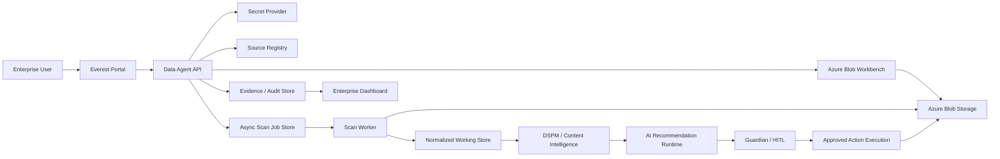

# Everest Enterprise Readiness Packet

Version: 3.0  
Date: June 2026  
Scope: Everest Enterprise Edition for governed Azure Blob operations, sensitive-data posture, real-time action control, evidence, AI-assisted recommendations, and extensible connector architecture.

## 1. Product Positioning

Everest is an enterprise data operations product for governed storage actions across customer-controlled environments. The Azure Blob edition provides source onboarding, sensitive-data discovery, operational workbench actions, AI-assisted recommendations, human-in-the-loop approvals, evidence capture, and action governance.

The product is designed for cloud-connected, private-network, hybrid, and air-gapped deployments. It must protect secrets, avoid unnecessary raw-data exposure, provide actionable dashboard intelligence, and support customer-specific connectors and AI providers through contracts.

## 2. Enterprise Capabilities

- Azure Blob source setup through user-friendly fields; backend builds and stores account access.
- Per-source credential isolation across multiple Azure Blob accounts.
- Configurable secret provider posture:
  - Windows Credential Manager
  - local file provider for controlled air-gapped environments
  - read-only environment provider
  - enterprise vault adapter contracts for Azure Key Vault, HashiCorp Vault, and Kubernetes secrets
- Dynamic dropdowns and suggestions for sources, containers, file IDs, blobs, policies, jobs, and AI providers.
- Azure Blob Workbench operations:
  - list containers
  - list blobs
  - view object
  - create/update object
  - download object
  - metadata and index tag changes
  - copy and move-prep
  - tier and rehydrate
  - delete with confirmation
- Preview-first and approval-aware action execution.
- Enterprise authorization mode with audit/enforce behavior for high-risk API paths.
- DSPM content intelligence with keyword/entity/pattern checks and model-profile contracts.
- AI-assisted recommendations with governed action canvas.
- HITL approval routing for restricted, destructive, cross-border, or high-risk actions.
- Evidence and audit records for source setup, scans, AI recommendations, approvals, workbench actions, and async scan lifecycle.
- Async Azure Blob scan job contract with checkpoint, resume, pause, cancel, and persisted job state.
- Async scan normalized result artifacts for reporting and evidence review.
- Connector-neutral architecture for built-in, HTTP runtime, external process, plugin, and customer-owned connectors.

## 3. Product Boundaries

| Area | Current enterprise status | Product boundary |
| --- | --- | --- |
| Azure Blob operations | Implemented for governed portal workflows. | Production rollout must validate customer IAM, network policy, and retention policy. |
| DSPM keyword/entity checks | Implemented for deterministic checks and configurable keyword patterns. | Full customer model runtime integration depends on selected provider and deployment mode. |
| BERT/domain NER profiles | Contract and UI architecture are present. | Production inference adapters must be deployed for selected model runtimes. |
| Async scan jobs | Queue/checkpoint/resume/cancel flow is present with persisted state, Azure Blob paging worker execution, and normalized result artifact output. | Production scale hardening requires worker pools, retry policy, throttling, and failover testing. |
| RBAC | Role-aware UX, approvals, and HITL flows exist. | Production identity federation and fine-grained authorization are required before customer production use. |
| Secret providers | Pluggable provider layer exists. | Production vault adapters must be implemented against the customer-approved vault. |
| Enterprise scale | Contracts and checkpoints are designed for scale. | Production scale requires worker pools, retry policy, throttling, metrics, and failover testing. |

## 4. Architecture

## 5. Data Flow

1. User selects a saved source, scope, object, policy, job, or recommendation from dynamic options.
2. Portal sends a governed request with source ID and scope.
3. Data Agent loads account access from the configured secret provider.
4. Connector performs read, preview, scan, or approved action.
5. Working store receives normalized metadata and governed content signals.
6. DSPM classifies risk using rules, entities, keyword patterns, and selected model profiles.
7. AI recommends actions using evidence-grounded context.
8. Guardian decides whether action is allowed, blocked, or requires HITL.
9. Approved actions execute against Azure Blob.
10. Evidence, audit, dashboard metrics, and next-step recommendations are updated.

## 6. Sensitive Data Handling

- Raw credentials are never displayed after save.
- Raw object content is hidden unless the user intentionally views or downloads it.
- Support payloads are hidden unless support/diagnostics visibility is enabled.
- Preview mode performs no mutation.
- Destructive and restricted actions require confirmation and/or approval.
- AI receives bounded, governed, and redacted context according to policy.
- Evidence records contain operational proof, not unrestricted raw file content.

## 6.1 Enterprise Authorization

Everest supports backend authorization checks for high-risk operations.

| Setting | Default | Behavior |
| --- | --- | --- |
| `EVEREST_AUTH_MODE=audit` | Yes | Unauthorized operations are allowed but recorded as authorization audit events. |
| `EVEREST_AUTH_MODE=enforce` | No | Unauthorized operations are blocked with HTTP 403 and recorded as blocked audit events. |

Identity headers:

- `X-Everest-Actor`
- `X-Everest-Role`
- `X-Everest-Tenant`

Initial guarded paths:

- source save/delete
- non-preview Azure Blob Workbench mutations
- async scan queue/resume/pause/cancel/fail/complete/checkpoint

Role examples:

- `platform_admin`
- `security_officer`
- `compliance_officer`
- `data_steward`
- `data_analyst`
- `agent_runtime`

## 7. Enterprise Test Scenarios

These scenarios are product validation scenarios using realistic sensitive-data conditions, not simple connectivity checks.

| ID | Scenario | User action | Expected dashboard/result | Required governance |
| --- | --- | --- | --- | --- |
| S1 | Public container contains PII documents | Discover containers, list objects, run DSPM scan | Dashboard shows exposed sensitive-data risk, object counts, severity, and recommended tagging/quarantine | HITL for quarantine/delete |
| S2 | HR folder contains employee IDs and payroll files | Run tiered content scan on selected prefix | Dashboard separates HR-sensitive objects, recommended metadata, evidence summary | Data steward review |
| S3 | Blob contains access token or API key | View governed preview, run keyword/entity scan | SECRET finding appears, risk escalates, action recommendation suggests restrict/quarantine | Security approval required |
| S4 | Healthcare/PHI file in incorrect container | Run DSPM scan and AI recommendation | PHI/entity finding, policy mismatch, suggested move-prep or quarantine | Compliance/HITL required |
| S5 | Cross-border movement request from India to UAE | Prepare copy/move-prep action | Guardian blocks or routes to HITL based on residency policy | Contract owner approval |
| S6 | Archive tier requested for active legal records | Select tier action to archive | Dashboard warns retention/legal-hold conflict; action is blocked or approval-gated | Records owner approval |
| S7 | Rehydrate archived sensitive evidence | Select rehydrate with high priority | Action preview shows cost/priority impact and evidence trail | Approval if restricted class |
| S8 | Ransomware-like file pattern detected | Scan prefix with suspicious extensions/names | High-risk cluster appears; recommendation suggests quarantine tags and access review | Security officer approval |
| S9 | Large account scan interrupted mid-run | Queue async scan, resume from checkpoint | Job state resumes from container/prefix/page marker, no duplicate evidence | Operational checkpoint proof |
| S10 | Customer adds second Azure Blob account | Save second source and switch Workbench source | Dashboard and Workbench use selected source-specific credential | Source isolation proof |
| S11 | Air-gapped customer environment | Use local secret provider and local AI/provider contracts | Runtime status shows no cloud dependency; operations use customer-controlled components | Deployment-mode evidence |
| S12 | Locked-down environment with pre-provisioned secrets | Use environment provider | Portal cannot overwrite secrets; operations can read pre-provisioned source access | Ops-controlled secret lifecycle |
| S13 | Bulk safe tagging recommended by AI | Run AI recommendation and apply tags in preview | Action canvas shows rationale, target objects, confidence, and preview result | HITL only for high-risk objects |
| S14 | Delete requested for sensitive object | Select delete action without confirmation | Action blocked; dashboard shows prevented destructive action | Explicit confirmation plus approval |
| S15 | Auditor requests proof for a completed action | Open Evidence Center and export records | Evidence includes source, object, actor, decision, policy, operation, status, timestamp | Audit export controls |

## 8. Expected Dashboard Signals

The enterprise dashboard must expose decision-grade information:

- total sources, containers, objects, and scanned records
- sensitive objects by severity
- public/exposed objects
- high-risk entities and policy violations
- jobs queued/running/failed/completed
- async checkpoint status
- async records written and normalized artifact availability
- async worker lease ownership, heartbeat, retries, and throttling posture
- stale async worker lease detection and operator-controlled reclaim
- approvals pending/approved/rejected
- actions previewed/applied/blocked
- AI recommendations by confidence and risk
- evidence health and export readiness
- secret provider posture without secret values
- next recommended action based on current state
- top enterprise risks with source/object context
- sensitive finding count and high-risk evidence count
- daily trend points for evidence, high-risk findings, sensitive findings, actions, and async records
- enterprise risk score and risk level derived from active evidence/action posture
- operational playbooks for sensitive-data and governed-action scenarios

## 9. Required Evidence

Every governed workflow must produce evidence for:

- who requested the operation
- selected source and data store
- container/prefix/object scope
- policy context
- DSPM findings
- AI recommendation and rationale
- Guardian decision
- HITL approval if required
- dry-run or apply mode
- action receipt or block reason
- timestamp and status

Enterprise evidence package endpoint:

`/v1/evidence/package`

The package includes:

- sources, containers, and object references
- evidence records
- audit events
- action records
- jobs and async scan jobs
- policies
- AI provider posture
- package generator identity

The package excludes raw secret values and unrestricted raw object content.

In authorization enforce mode, evidence package generation requires one of:

- `platform_admin`
- `security_officer`
- `compliance_officer`
- `auditor`

## 9.1 Enterprise Posture Analytics

Everest exposes an enterprise posture endpoint for dashboard and reporting:

`/v1/analytics/enterprise-posture`

The endpoint summarizes:

- source, container, object, evidence, audit, and action counts
- sources missing configured account access
- sensitive findings
- high-risk evidence
- async job state and records written
- async retries, throttling, worker heartbeat, and lease expiry
- stale worker lease count and reclaim action
- pending actions and approvals
- risk distribution by severity
- top risk items
- recommended next actions
- daily trend points for dashboard history
- enterprise risk score and level

Risk score inputs:

- high-risk evidence
- sensitive findings
- pending actions
- pending approvals
- active async jobs
- large object population

This endpoint is the preferred backend contract for dashboard posture instead of screen-only calculations.

## 9.2 Enterprise Operational Playbooks

Everest exposes scenario playbooks through:

`/v1/playbooks/enterprise`

Initial playbooks:

- PII Exposure Response
- Secret Or Token Detection
- PHI Misplacement Review
- Cross-Border Transfer Control
- Legal Hold Tier Change Review
- Ransomware Indicator Containment
- Large Account Scan Operations

Each playbook includes:

- scenario
- priority
- recommended roles
- recommended actions
- required evidence
- HITL requirement

## 10. Deployment Modes

| Mode | Requirement |
| --- | --- |
| Cloud-connected | Customer-approved network path to Azure Blob, optional cloud AI provider, enterprise vault adapter. |
| Private network | Private endpoints, customer-controlled AI/runtime, approved secret provider. |
| Hybrid | Local Agent Cell with controlled outbound services and central evidence/dashboard sync. |
| Air-gapped | Local file or customer vault secrets, local AI/runtime, offline connector packages, exportable evidence bundles. |

## 11. Next Engineering Priorities

1. Add enterprise identity/RBAC enforcement.
2. Implement production vault adapters.
3. Add model runtime adapters for local BERT/domain NER.
4. Add dashboard trend analytics and risk history.
5. Add worker pool metrics, throttling, and failover behavior.
