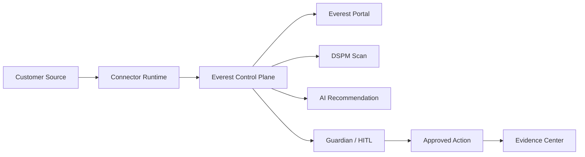

# Everest Fresher Quick Reference

## What Everest Is

Everest is an enterprise data operations and governance portal focused on Azure Blob today, with a connector-neutral architecture for future sources.

It helps customers:

- Discover data sources and objects.
- Configure connectors.
- Scan metadata and content.
- Detect sensitive data and policy risk.
- Use AI for recommendations and summaries.
- Keep risky actions behind Guardian and human approval.
- Execute safe operations through a governed portal.
- Preserve evidence and audit history.

## One Sentence Product Description

Everest is a governed control plane where customers can discover, scan, classify, remediate, and audit enterprise data across Azure Blob and future connectors, with AI assistance and HITL controls.

## Main Modules

| Module | What It Does | Who Uses It |
| --- | --- | --- |
| Enterprise Dashboard | Summary of environment, jobs, risks, and health | admins, operators |
| Source Inventory | Shows configured sources, containers, and objects | admins, data owners |
| Azure Blob Workbench | Portal UI for Azure Blob list/view/upload/update/action testing | testers, admins |
| Connector Catalog | Built-in, planned, and custom connector management | architects, admins |
| AI Tools | Configure AI providers and runtime behavior | admins, AI/security owners |
| Onboarding | Guided setup for sources and runtime | admins |
| Scans and Jobs | Run and monitor inventory/content scans | operators, testers |
| Evidence Center | Review evidence for scans, recommendations, and actions | auditors, security |
| Guardian Agent | Policy and risk guardrails | security, approvers |
| Action Center | Pending approvals and action execution status | approvers, operators |
| Policy Governance | Rules for what is allowed, blocked, or needs approval | governance owners |
| Agent Working Store | Intermediate agent context and working data | engineering, advanced users |
| Diagnostics | Health and troubleshooting | support, developers |

## Key Concepts

| Term | Meaning |
| --- | --- |
| Connector | Adapter that lets Everest talk to a data source |
| Connector runtime | Running service/process that executes connector operations |
| Source | A configured customer system, such as Azure Blob Storage |
| Container | Azure Blob container or equivalent grouping in another connector |
| Item or file ID | A specific object/blob/file selected for scan or action |
| Scan | Job that reads metadata or content and produces findings |
| DSPM | Data Security Posture Management, including sensitive data and exposure checks |
| Tiered content scan | Scan that moves from metadata to rules to model/deep analysis |
| Keyword pattern | Built-in or custom text/regex rule for detecting customer-defined sensitive content |
| AI provider | Local, private, cloud, or custom AI runtime used for recommendations |
| HITL | Human in the loop approval before risky actions |
| Guardian | Policy layer that allows, blocks, or sends actions for approval |
| Evidence | Audit-ready record showing what happened and why |
| Dry-run | Safe mode where Everest plans actions but does not mutate customer data |

## Mental Model



Read it like this:

1. Customer data stays in the customer source.
2. A connector runtime discovers or acts on that source.
3. Everest normalizes the result into portal workflows.
4. DSPM and AI can recommend what to do.
5. Guardian decides whether the action is safe, blocked, or needs approval.
6. Evidence records the result.

## First Day Learning Path

### First 30 Minutes

Read:

- `docs/everest_self_learning_master_guide.md`
- `docs/everest_screen_by_screen_guide.md`
- This quick reference

Understand:

- What each screen is for.
- What dry-run means.
- Why AI does not automatically mean action execution.
- Why dropdowns should be populated from existing discovered items.

### First 60 Minutes

Read:

- `docs/everest_database_and_data_flow.md`
- `docs/everest_api_event_mapping.md`
- `docs/everest_field_dictionary.md`

Understand:

- Source, container, item, scan, finding, action, approval, and evidence flow.
- Which fields are IDs versus display labels.
- How APIs map to UI behavior.

### First Half Day

Read:

- `docs/everest_deployment_modes.md`
- `docs/everest_troubleshooting_runbook.md`
- `docs/everest_test_strategy_and_test_cases.md`

Practice:

- Use the portal in dry-run mode.
- Configure or select an Azure Blob source.
- Discover containers.
- Select a blob/object from dropdown.
- Run a metadata or content scan.
- Review findings.
- Send an action to approval.
- Review evidence.

## Recommended Reading Order

| Order | Document | Why |
| --- | --- | --- |
| 1 | `everest_fresher_quick_reference.md` | Fast orientation |
| 2 | `everest_self_learning_master_guide.md` | End-to-end concept guide |
| 3 | `everest_screen_by_screen_guide.md` | Learn the portal |
| 4 | `everest_field_dictionary.md` | Understand fields |
| 5 | `everest_api_event_mapping.md` | Understand API behavior |
| 6 | `everest_database_and_data_flow.md` | Understand persistence and data movement |
| 7 | `everest_deployment_modes.md` | Understand customer environment types |
| 8 | `everest_test_strategy_and_test_cases.md` | Learn how to validate |
| 9 | `everest_troubleshooting_runbook.md` | Learn how to debug |

## Portal Workflow Cheat Sheet

### Azure Blob Happy Path

1. Open Source Inventory or Azure Blob Workbench.
2. Enter or select Azure Blob connection.
3. Discover containers.
4. Select container from dropdown.
5. List blobs.
6. Select file/object ID from dropdown.
7. View metadata/tags/content preview where allowed.
8. Run scan.
9. Review findings.
10. Review recommended action.
11. Send to Guardian/HITL if required.
12. Execute only after approval.
13. Confirm Evidence Center record.

Expected output:

- Source status is available.
- Container dropdown has existing containers.
- File/object dropdown has existing blobs.
- Scan result has status and findings or a clear no-findings message.
- Risky actions are pending approval or blocked.
- Evidence record exists after scan/action.

### AI Tools Happy Path

1. Open AI Tools.
2. Refresh provider catalog.
3. Select provider.
4. Confirm data boundary.
5. Test provider.
6. Use sample runtime if needed.
7. Invoke AI runtime.
8. Review recommendation and summary.
9. Confirm whether prompt was sent.
10. Check Evidence Center.

Expected output:

- Provider card shows runtime and boundary.
- Test provider returns `ok` or clear error.
- AI summary/recommendation appears.
- Autonomous apply remains blocked unless explicitly enabled.
- HITL is used for risky actions.

### DSPM Scan Happy Path

1. Select source/container/object.
2. Select scan tier.
3. Enable built-in keyword pack.
4. Add custom keyword pattern if needed.
5. Run content scan.
6. Review finding type, severity, confidence, and detail.
7. Review policy and recommended action.
8. Confirm evidence.

Expected output:

- Metadata tier runs quickly.
- Rule/keyword tier identifies matching patterns.
- Model tier runs only if model provider is configured.
- Deep tier runs only when enabled and supported.

### Connector Catalog Happy Path

1. Open Connector Catalog.
2. Select connector.
3. Review supported deployment modes.
4. Validate runtime contract.
5. Select action ID from dropdown.
6. Invoke in dry-run mode.
7. Confirm runtime status and evidence.

Expected output:

- Connector status is available or custom manifest.
- Runtime endpoint is visible.
- Supported actions are listed.
- Dry-run invocation returns a safe result.

## What To Check When Something Looks Wrong

| Symptom | First Check |
| --- | --- |
| Dropdown empty | Run discovery or refresh source/provider list |
| No rows under Check/Result/Detail | Operation returned summary only; check status card |
| Button works but data unchanged | Check dry-run mode and Action Center |
| AI result missing | Check provider status and prompt boundary |
| Scan no findings | Check tier, keyword packs, pattern syntax, and scope |
| Action pending | Open Action Center |
| Action blocked | Open Guardian Agent |
| Evidence missing | Clear Evidence filters and re-run operation |
| Azure cannot connect | Check credentials, firewall, private endpoint, permissions |
| Runtime unavailable | Check Connector Catalog and Diagnostics |

## Files A Fresher Should Know

| File Or Folder | Why It Matters |
| --- | --- |
| `web/index.html` | Main portal UI |
| `internal/api` | Backend API handlers |
| `internal/dspm` | DSPM scan engine and content intelligence logic |
| `cmd/sample-plugin-runtime` | Local sample connector and AI runtime |
| `cmd/azureblob-test-tool` | Azure Blob test utility |
| `docs` | Product, engineering, testing, and handoff docs |

## API Groups To Remember

| API Area | Purpose |
| --- | --- |
| Health | Portal/backend/runtime health |
| Azure Blob config/workbench | Source setup and blob operations |
| Connector runtime | Custom and built-in connector invocation |
| DSPM | Catalog and content scan |
| AI providers | Provider catalog, test, runtime invocation |
| Scans and jobs | Start and track scan work |
| Guardian/policy | Decide allow, block, or HITL |
| Action Center | Approval and action execution |
| Evidence | Audit-ready results |

## Safe Testing Rules

- Start in dry-run mode.
- Use a dedicated test storage account or test container.
- Use test blobs with non-production content.
- Do not test delete, overwrite, archive, or permission changes on real customer data.
- Confirm soft delete/versioning before destructive Azure Blob tests.
- Use HITL approval for risky operations.
- Capture evidence records for every important test.
- Use dropdown-selected existing items where possible.

## Expected UI Behaviors

| Area | Expected Behavior |
| --- | --- |
| Source selection | Existing sources appear in dropdown |
| Container selection | Containers discovered from Azure appear in dropdown |
| File/object ID | Existing blobs appear in dropdown |
| Policies | Existing policies appear in dropdown |
| Jobs | Existing jobs appear in dropdown or job table |
| AI providers | Configured providers appear in catalog/dropdown |
| Actions | Supported action IDs appear based on connector capability |
| Empty data | UI explains why and how to populate it |
| Risky action | Guardian blocks or sends to approval |
| Dry-run | No customer data mutation |

## How To Explain Everest To A Customer

Use this:

```text
Everest gives your teams a governed portal to discover enterprise data, scan it for risk, use AI to recommend safe remediation, route risky actions for approval, and keep evidence for audit. Azure Blob is the current focus, and the platform is designed so future connectors and customer-owned connectors can plug into the same workflow.
```

## How To Explain AI In Everest

Use this:

```text
AI in Everest is configurable by customer boundary. It can summarize evidence, recommend actions, explain risk, or help plan remediation. By default, AI is advisory. Risky or destructive actions remain behind Guardian policies and human approval unless the customer explicitly allows controlled automation.
```

## How To Explain Air-Gapped Support

Use this:

```text
Everest is designed so the same portal workflows can run in restricted environments. In air-gapped mode, connectors, evidence, database, and AI must run inside the customer environment, with offline package import and no dependency on internet-hosted services.
```

## Common Mistakes

- Treating an AI recommendation as an approval.
- Testing live actions while still expecting dry-run behavior.
- Assuming a connection string always gives container list permission.
- Forgetting that SAS tokens can be scoped to one container.
- Expecting cloud AI to work in air-gapped mode.
- Testing delete or archive against real data.
- Assuming empty Check/Result/Detail rows mean failure.
- Forgetting to refresh inventory after upload or source changes.
- Adding a connector without defining actions, risk, deployment modes, and evidence behavior.

## Definition Of Done For A New Feature

A feature is not enterprise-ready until it has:

- UI workflow.
- API contract.
- Data model or persistence plan.
- Deployment-mode behavior.
- RBAC/security expectation.
- Guardian/HITL behavior if it can mutate data.
- Evidence behavior.
- Audit behavior.
- Dry-run behavior.
- Test cases.
- Troubleshooting notes.

## Quick Test Script For Manual Testers

Use this sequence for a basic end-to-end check:

1. Confirm header health badges are healthy.
2. Open Diagnostics and confirm runtime status.
3. Open Azure Blob Workbench.
4. Configure or select Azure Blob connection.
5. Discover containers.
6. Select a test container.
7. List blobs.
8. Select a test object.
9. View metadata.
10. Run DSPM scan with keyword pack enabled.
11. Review findings.
12. Request safe tag or metadata update in dry-run.
13. Confirm Guardian decision.
14. If pending, approve in Action Center.
15. Confirm Evidence Center record.

Expected final state:

- No production data changed unless live mode was explicitly used.
- Finding or no-finding result is understandable.
- Action status is visible.
- Evidence exists.
- Any error has a clear next step.

## Where To Go Next

For product understanding:

- `docs/everest_self_learning_master_guide.md`
- `docs/everest_screen_by_screen_guide.md`

For engineering:

- `docs/everest_database_and_data_flow.md`
- `docs/everest_api_event_mapping.md`
- `docs/everest_deployment_modes.md`

For testing and support:

- `docs/everest_test_strategy_and_test_cases.md`
- `docs/everest_troubleshooting_runbook.md`
- `docs/everest_field_dictionary.md`

