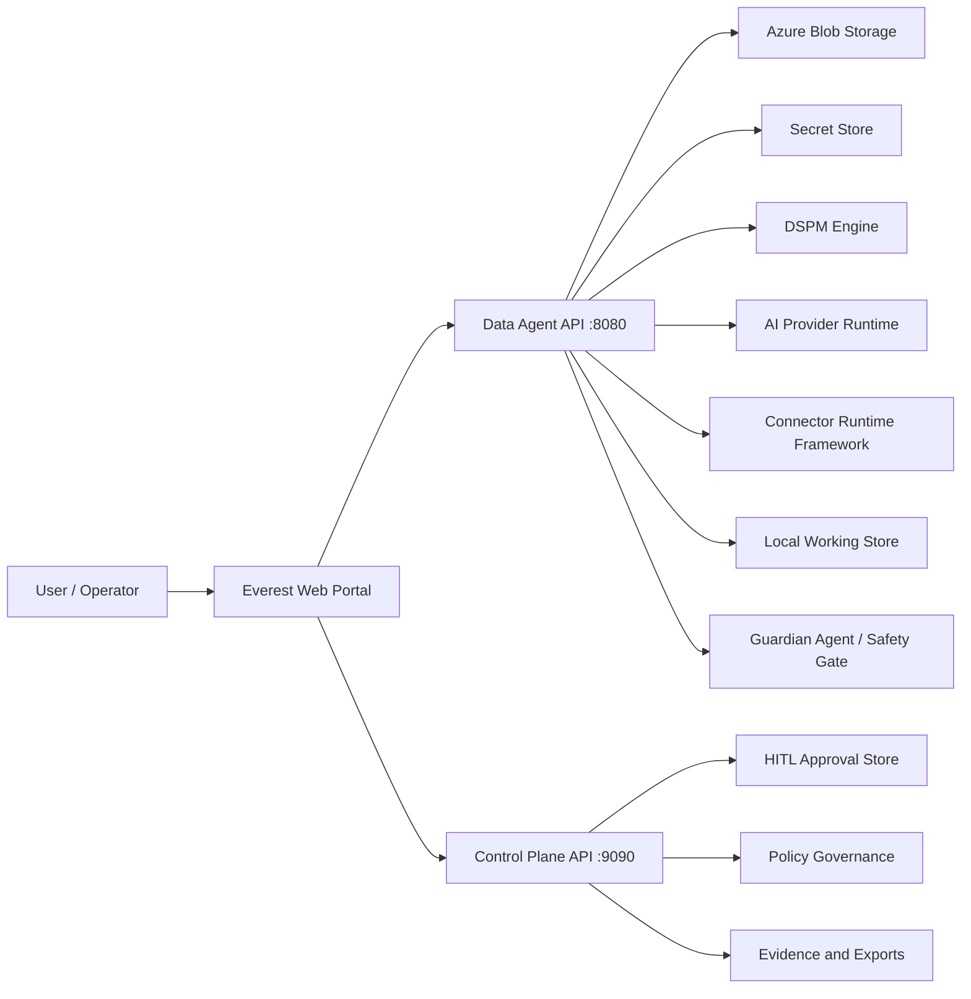
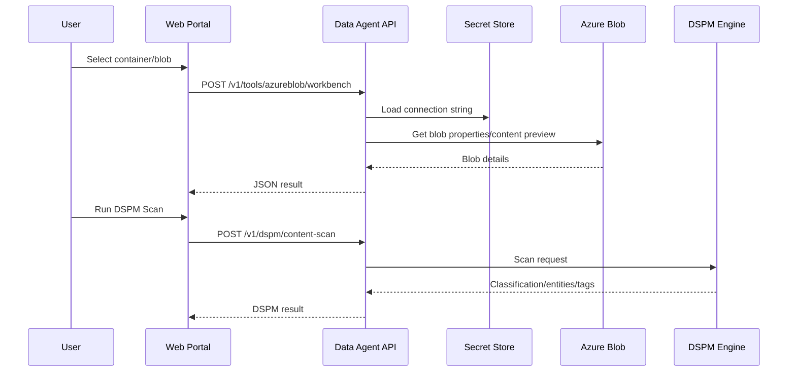
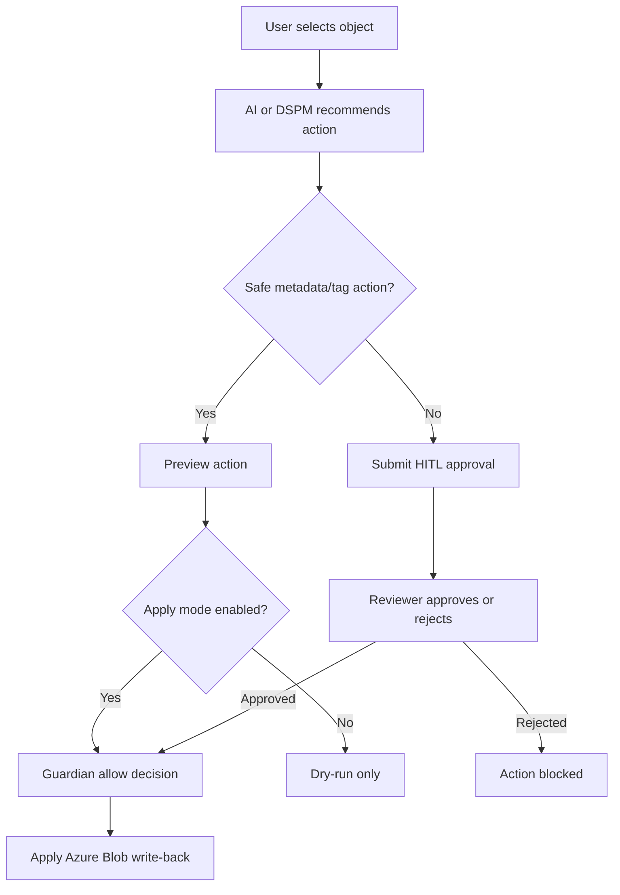
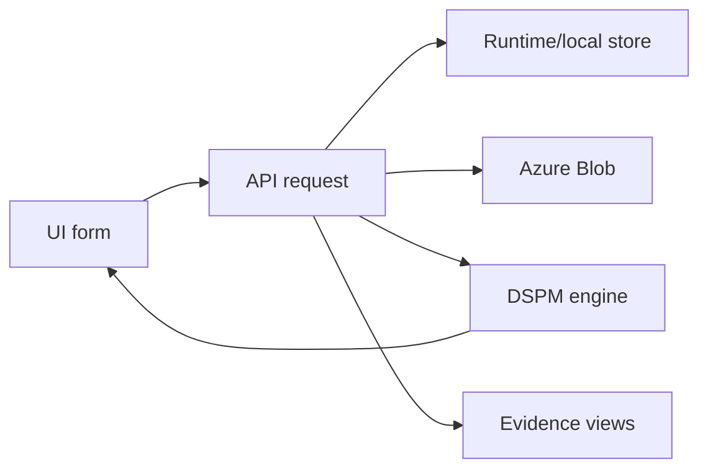

# Everest Self-Learning Master Guide

Version: Draft 1  
Checkpoint date: 2026-06-13  
Product: Everest Enterprise Data Operations - Azure Blob Edition

## How To Use This Guide

This guide is written for a fresher or new joiner who has no prior project knowledge. Read it from top to bottom once, then use the quick reference, test strategy, and troubleshooting sections during hands-on validation.

Some enterprise capabilities are already implemented. Some are planned or partially scaffolded. This document marks those clearly:

- Current: available in the local application today.
- Partial: available as a demo or contract, but not production-complete.
- Planned: architecture direction, not fully implemented yet.

## 1. Executive Summary

### What This Application Is

Everest is an enterprise data operations and governance application. The current edition focuses on Azure Blob Storage. It helps a customer connect to Azure Blob, discover containers and objects, inspect content, classify risk, generate evidence, get AI/DSPM recommendations, and apply governed actions such as metadata tagging, index tagging, archive, quarantine, migration, rehydrate, retrieve, or delete.

### Business Problem It Solves

Large enterprises store many files and objects in cloud storage. Over time, teams lose visibility into:

- What data exists.
- Which data is sensitive.
- Which data needs policy review.
- Which actions are safe.
- Which actions require human approval.
- Whether evidence exists for audit and compliance.

Everest solves this by giving operators one portal to discover, analyze, govern, approve, and audit data operations.

### High-Level Value

Everest provides:

- Source discovery for Azure Blob.
- Data security posture management, also called DSPM.
- AI-assisted recommendations behind action verbs instead of open-ended chat.
- HITL, meaning human-in-the-loop approval, for risky actions.
- Guardian safety checks before write-back actions.
- Evidence generation for compliance and audit.
- Connector/plugin architecture for future sources.

### Who Uses It

| User Type | What They Do In Everest |
|---|---|
| Data operations user | Connects sources, runs scans, reviews results. |
| Data steward | Reviews object classification and approves metadata/index tags. |
| Security officer | Reviews risk, secrets, sensitive data, and unsafe actions. |
| Compliance/audit user | Reviews evidence, provenance, policy decisions, and exports. |
| Platform administrator | Configures connectors, AI providers, credentials, and runtime settings. |
| Solution architect | Designs customer deployment and integration model. |
| QA/tester | Validates functional, security, integration, and failure scenarios. |
| Connector/plugin developer | Builds future connector or AI provider integrations. |

## 2. Business Journey

### End-To-End Workflow In Plain English

1. A customer has data in Azure Blob Storage.
2. The operator opens Everest and configures the Azure Blob connection.
3. Everest discovers containers and objects.
4. The operator runs a scan or uses Azure Blob Workbench to inspect objects.
5. Everest creates normalized file records and evidence.
6. DSPM checks metadata, keywords, patterns, and sampled content.
7. AI recommends safe actions through buttons such as Recommend Tags or Prepare Quarantine.
8. Safe actions can be previewed or applied under policy.
9. Risky actions go through HITL approval.
10. Guardian Agent validates that the action is allowed.
11. Everest applies approved Azure Blob metadata/index tags or other governed actions.
12. Evidence and audit records help compliance teams prove what happened.

### Real-Life Example

A company stores HR files in Azure Blob. A file named:

```text
hr/payroll/2026/confidential_salary_review.csv
```

is discovered. Everest detects sensitive keywords such as `payroll`, `confidential`, and `salary`. DSPM classifies it as confidential or restricted. AI recommends applying index tags:

```text
everest_dspm_classification=restricted
everest_dspm_hitl=true
everest_dspm_entities=financial_term
```

Because the object is sensitive, Everest requires HITL approval before any risky operation such as quarantine, archive, migration, or delete. After approval, the action is applied and recorded for audit.

### Main Actors

| Actor | Responsibility |
|---|---|
| Operator | Configures source and runs scans. |
| Data steward | Reviews classification and metadata/index tags. |
| Security officer | Reviews high-risk or destructive actions. |
| Compliance reviewer | Reviews evidence and audit history. |
| Guardian Agent | Enforces safety gates before actions. |
| AI/DSPM engine | Recommends classification, tags, and next actions. |

## 3. System Overview

### High-Level Architecture

Everest currently runs as a local portal and service. The browser UI calls local APIs. The local APIs communicate with Azure Blob, local stores, policy logic, AI runtime contracts, connector runtime contracts, and DSPM logic.



### Major Components

| Component | What It Does | Why It Exists |
|---|---|---|
| Web Portal | Provides screens for source setup, workbench, scans, AI, DSPM, actions, evidence, and diagnostics. | Users need a no-command-line interface. |
| Data Agent API | Runs local connector, DSPM, AI, and action APIs. | Keeps data operations close to customer environment. |
| Control Plane API | Handles onboarding, jobs, leases, approvals, exports, and governance views. | Separates platform governance from local data operations. |
| Azure Blob Connector | Lists containers/blobs, scans metadata, and applies actions. | Azure Blob is the first supported enterprise source. |
| Azure Blob Workbench | UI and API for testing object operations. | Customers need a safe way to create/view/update/test blob scenarios. |
| DSPM Engine | Classifies content and detects entities, keywords, and risk. | Data security posture requires content intelligence. |
| AI Provider Framework | Supports customer AI providers and private/local/cloud model options. | Customers may have internet, private, or air-gapped AI environments. |
| Connector Runtime Framework | Supports built-in and custom connectors. | Everest must support future connector types. |
| Guardian Agent | Blocks or allows governed actions. | Prevents unsafe or unauthorized data changes. |
| Local Working Store | Stores normalized records and evidence views. | Scans and evidence need queryable local state. |
| Secret Store | Stores sensitive values such as Azure connection string. | Credentials must not remain exposed in UI fields. |

## 4. Module Breakdown

### Enterprise Dashboard

Purpose: Shows current operating posture, latest execution, evidence status, risk counts, and next suggested action.

Why it exists: Enterprise users need one landing page to understand whether the environment is ready, scanning, blocked, or pending review.

Dependencies:

- Platform dashboard API.
- Agent runtime status.
- Evidence and local store data.

Failure impact:

- Users lose summary visibility.
- Underlying modules may still work.

How to test:

- Open the dashboard.
- Refresh after running a scan.
- Verify latest execution and object counts change.

### Source Inventory

Purpose: Configures and validates Azure Blob source details.

Why it exists: Everest needs to know which storage account/container/prefix to scan.

Key fields:

| Field | Purpose |
|---|---|
| Connector | Selects source type. Current main value: Azure Blob Storage. |
| Deployment mode | Describes customer environment: cloud, private network, air-gapped, hybrid. |
| Storage account | Human-readable account name. |
| Containers | One or more target containers. |
| Prefix / scope | Optional blob prefix to narrow scan. |
| Data store ID | Everest ID for the source. |
| Connection string | Secret used by local agent to connect to Azure Blob. |

Failure impact:

- Incorrect connection string blocks Azure access.
- Incorrect container causes empty scans or errors.

How to test:

- Save connection string.
- Discover containers.
- Test connection.

### Azure Blob Workbench

Purpose: Allows no-command-line testing of Azure Blob operations.

Current operations:

- Discover containers.
- List blobs.
- View blob.
- Create blob.
- Update blob.
- Set metadata.
- Set index tags.
- Download blob.
- Delete blob with confirmation.
- Run AI action verbs.
- Run DSPM scan.

Why it exists: Customers and QA need a safe portal-based tool to generate and validate Azure Blob scenarios.

Important safeguards:

- Dry-run is enabled by default.
- Delete requires confirmation text `DELETE`.
- Risky actions can be sent to HITL.

Failure impact:

- Users cannot test Azure Blob scenarios from UI.
- Connector functionality may still work through backend or CLI.

How to test:

- Discover containers.
- Create a test blob with dry-run on.
- Clear dry-run and create it.
- View it.
- Run DSPM scan.
- Apply tags.
- Download it.
- Dry-run delete, then delete with confirmation.

### Connector Catalog

Purpose: Lists built-in, planned, and customer-owned connectors.

Why it exists: Everest is designed to support more than Azure Blob in the future.

Current state:

- Azure Blob is implemented.
- Other connectors are represented as catalog/contract-ready or planned.

Failure impact:

- Users cannot inspect connector capabilities.
- Future connector onboarding is harder to explain.

How to test:

- Open Connector Catalog.
- Select Azure Blob.
- Validate runtime contract.

### AI Tools

Purpose: Configures AI providers, model profiles, and safety policy.

Why it exists: Customers may use different AI environments:

- Cloud-connected AI.
- Private LLM gateway.
- Local/offline model.
- Air-gapped customer model.

Current capabilities:

- Provider catalog.
- Provider config.
- Provider test.
- Runtime invocation.
- AI recommendation history.

Failure impact:

- AI recommendations may fall back to local guardrails.
- Core Workbench operations still work.

How to test:

- Load provider catalog.
- Save/test provider config.
- Invoke sample runtime.

### DSPM Engine

Purpose: Performs content intelligence and data security posture checks.

Scan tiers:

| Tier | What It Does |
|---|---|
| metadata | Checks path, file ID, size, type, metadata, and tags. |
| rules | Runs local deterministic patterns over sampled content. |
| model | Uses model profile contract, such as BERT/NER. Current runtime integration is planned. |
| deep | Planned delegated full-content or large-sample scan. |

Current detections:

- Keywords and custom keyword patterns.
- Email.
- Phone.
- Credit card with Luhn validation.
- SSN-like values.
- India PAN-like values.
- Secrets, tokens, passwords, API keys.

Failure impact:

- Sensitive data may not be classified correctly.
- HITL may not be triggered for high-risk content.

How to test:

- View a blob with sample content.
- Run DSPM tier `rules`.
- Add custom keyword patterns.
- Verify entities, risk score, classification, tags, and HITL flag.

### Action Center

Purpose: Runs governed Azure Blob actions.

Actions:

- Apply metadata.
- Apply index tags.
- Archive.
- Retrieve.
- Rehydrate.
- Quarantine.
- Migration.
- Delete.

Why it exists: Enterprise data actions must be controlled, not ad hoc.

Failure impact:

- Approved operations cannot be applied.
- Risky operations may remain pending.

How to test:

- Prepare action from AI/DSPM.
- Preview action.
- Submit HITL if required.
- Apply approved action.

### Guardian Agent

Purpose: Enforces safety decisions before actions.

Why it exists: Some operations are destructive or sensitive. Guardian prevents accidental or unauthorized actions.

Failure impact:

- Unsafe actions could be blocked.
- If unavailable, apply mode should not proceed for restricted actions.

How to test:

- Run a dry-run action.
- Attempt a restricted action without confirmation.
- Verify it is blocked or routed to HITL.

### Evidence Center

Purpose: Shows evidence, provenance, and audit proof for executions.

Why it exists: Compliance teams need proof of what was scanned, decided, and applied.

Failure impact:

- Audit users cannot validate outcomes.
- Production readiness is reduced.

How to test:

- Run scan.
- Open Evidence Center.
- Verify summary, manifest, provenance, and exports.

## 5. Component Interaction Flow

### Azure Blob Workbench View Flow

1. User opens Azure Blob Workbench.
2. User saves or uses an Azure connection string.
3. UI calls `/v1/tools/azureblob/workbench`.
4. Data Agent loads saved connection string from secret store if one is not sent.
5. Data Agent creates Azure Blob SDK client.
6. Data Agent lists containers, lists blobs, or downloads object preview.
7. UI renders object details and suggestions.
8. User can run DSPM or AI verbs from the selected object.



### Action Governance Flow



## 6. Screen-By-Screen Guide

### Enterprise Dashboard

Navigation: Left menu -> Enterprise Dashboard

Purpose:

- Show current enterprise posture.
- Help user pick next step.

Main controls:

| Control | Why It Exists |
|---|---|
| Refresh Dashboard | Reloads latest posture and execution state. |
| Validate Source | Moves user to Source Inventory. |
| Role tabs | Shows views for CIO, CISO, compliance, data steward, AI readiness, and audit. |

Common mistakes:

- Expecting data before running a scan.
- Not refreshing after new execution.

Test scenarios:

- Refresh with no execution.
- Refresh after scan.
- Verify role views do not overlap or break layout.

### Source Inventory

Navigation: Left menu -> Source Inventory

Purpose:

- Configure Azure Blob connection.
- Discover containers.
- Validate source before onboarding.

Fields:

| Field | Mandatory | Example | Impact If Wrong |
|---|---|---|---|
| Connector | Yes | azureblob | Wrong connector causes invalid runtime path. |
| Deployment mode | Yes | private_network | Affects architecture assumptions. |
| Storage account | No | hulk01 | Display/context only unless mapped later. |
| Containers | Yes for scan | customer-demo | Wrong container causes empty or failed scan. |
| Prefix / scope | No | hr/payroll | Wrong prefix hides objects. |
| Data store ID | Yes | azureblob-hulkb01 | Wrong ID breaks evidence/policy mapping. |
| Connection string | Yes initially | Azure connection string | Wrong secret blocks Azure access. |

API calls:

- `GET /v1/connectors/azureblob/config`
- `POST /v1/connectors/azureblob/config`
- `POST /v1/connectors/azureblob/test`
- `POST /v1/tools/azureblob/workbench` with `list_containers`

### Azure Blob Workbench

Navigation: Left menu -> Azure Blob Workbench

Purpose:

- Test all major Azure Blob object operations from UI.
- Run AI and DSPM actions from object context.

Important fields:

| Field | Purpose | Mandatory |
|---|---|---|
| Connection string | Save/use Azure credential. | Required if no saved credential exists. |
| Container | Target Azure Blob container. | Required for blob operations. |
| Blob path | Target object path. | Required for object operations. |
| Operation | Selected workbench action. | Yes |
| Prefix | Limits list operation scope. | No |
| Content type | Sets blob content type. | No |
| Metadata | Key-value pairs for metadata. | Required for set metadata. |
| Index tags | Key-value pairs for blob index tags. | Required for set tags. |
| Dry-run | Preview without mutating Azure. | Recommended |
| Confirm | Required text for delete. | Required for delete |

AI controls:

| Verb | Purpose |
|---|---|
| Recommend Tags | Generate safe classification/index tags. |
| Complete Metadata | Generate ownership/review metadata. |
| Prepare Archive | Create governed archive plan. |
| Prepare Quarantine | Create governed quarantine plan. |
| Delegate Assessment | Review container/prefix and produce recommended verbs. |

DSPM controls:

| Field | Purpose |
|---|---|
| Scan tier | Chooses metadata/rules/model/deep scan behavior. |
| Model profile | Selects built-in rules, local BERT, domain BERT, or cloud language profile. |
| Keyword pack | Chooses built-in business keyword pack. |
| Keyword exclusions | Suppresses false positives. |
| Custom keyword patterns | Adds customer vocabulary without code changes. |

API calls:

- `POST /v1/tools/azureblob/workbench`
- `POST /v1/dspm/content-scan`
- `POST /v1/ai/azureblob/recommendations`
- `POST /v1/connectors/azureblob/actions/execute`

Common mistakes:

- Forgetting to clear dry-run before expected write.
- Trying to delete without `DELETE` confirmation.
- Running DSPM without viewing/selecting a blob first.
- Using a SAS/connection string without tag permissions.

### AI Tools

Purpose:

- Configure customer AI provider options.
- Validate provider manifest/runtime.
- Support cloud, private, and air-gapped model strategies.

Key fields:

- Provider ID.
- Endpoint URL.
- Model.
- Deployment name.
- Auth scheme.
- Network mode.
- Automation mode.
- Redaction mode.
- HITL settings.

### Action Center

Purpose:

- Execute governed Azure Blob actions.
- Preview and apply under policy.

Common actions:

- Apply metadata.
- Apply index tags.
- Archive.
- Rehydrate.
- Quarantine.
- Migration.
- Delete.

## 7. Field Dictionary Summary

The detailed field dictionary should be created as `everest_field_dictionary.md`. This master guide includes the most important fields.

| Field Name | Layer | Module | Description | Required | Example | Impact If Wrong |
|---|---|---|---|---|---|---|
| connection_string | UI/API/Secret | Source/Workbench | Azure Storage credential. | Yes initially | DefaultEndpointsProtocol=... | Azure operations fail or target wrong account. |
| container | UI/API | Azure Blob | Azure Blob container name. | Yes for blob ops | customer-demo | Empty list or wrong data scope. |
| prefix | UI/API | Scan/Workbench | Blob path prefix filter. | No | hr/payroll | Missing or extra objects in scan. |
| blob | UI/API | Workbench | Blob object path. | Yes for object ops | everest-test/a.txt | Wrong object modified or viewed. |
| operation | UI/API | Workbench/Action | Action to execute. | Yes | list_blobs | Wrong action may mutate data. |
| dry_run | UI/API | Workbench/Action | Preview mode. | No | true | If false accidentally, action may apply. |
| confirm | UI/API | Delete | Required confirmation text. | For delete | DELETE | Delete blocked if missing. |
| metadata | UI/API/Azure | Metadata | Blob metadata key-values. | For metadata action | owner=qa | Wrong audit/classification. |
| tags | UI/API/Azure | Index tags | Azure Blob index tags. | For tag action | classification=restricted | Policy/search incorrect. |
| scan_tier | UI/API | DSPM | DSPM scan depth. | Yes | rules | Too shallow may miss content risk. |
| model_profile | UI/API | DSPM | Model/runtime profile. | Yes | builtin-rules | Wrong model expectation. |
| keyword_profile | UI/API | DSPM | Built-in keyword pack. | No | finance-hr | Missed or excessive keyword matches. |
| keyword_patterns | UI/API | DSPM | Custom customer patterns. | No | Project X|high|CUSTOM_ENTITY|phrase | Customer-specific risks missed. |
| action_mode | UI/API | Governance | dry_run or apply mode. | Yes | dry_run | Unsafe apply if misconfigured. |
| writeback_enabled | UI/API | Governance | Allows write-back. | Yes | false | Approved changes may not apply. |
| guardian_decision | API | Action | Safety decision. | For apply | allow | Action blocked or unsafe. |
| execution_id | API/DB | Evidence | Execution identifier. | For evidence | exec-azureblob-... | Evidence not linked. |
| data_store_id | UI/API/DB | Source | Logical data source ID. | Yes | azureblob-hulkb01 | Policy/evidence mismatch. |

## 8. API And Event Mapping Summary

Detailed API mapping should be created as `everest_api_event_mapping.md`.

| API | Method | Purpose | Main Consumer |
|---|---|---|---|
| `/healthz` | GET | Data Agent health. | UI/diagnostics |
| `/v1/connectors/azureblob/config` | GET/POST | Load/save Azure Blob config. | Source Inventory |
| `/v1/connectors/azureblob/test` | POST | Test saved Azure connection. | Source Inventory |
| `/v1/connectors/azureblob/containers` | GET | List configured account containers. | Source Inventory |
| `/v1/connectors/azureblob/scan` | POST | Run metadata scan. | Source/Scans |
| `/v1/tools/azureblob/workbench` | POST | Run Workbench operations. | Azure Blob Workbench |
| `/v1/dspm/catalog` | GET | Get DSPM tiers/models/checks/keyword packs. | Workbench/DSPM UI |
| `/v1/dspm/content-scan` | POST | Run DSPM scan. | Workbench |
| `/v1/ai/providers/catalog` | GET | List AI providers. | AI Tools |
| `/v1/ai/providers/config` | GET/POST | Load/save AI provider config. | AI Tools |
| `/v1/ai/providers/test` | POST | Test AI provider. | AI Tools |
| `/v1/ai/runtime/invoke` | POST | Invoke configured AI runtime. | AI Tools |
| `/v1/ai/azureblob/recommendations` | POST | Get Azure Blob recommendations. | Workbench/Action Center |
| `/v1/connectors/azureblob/actions/execute` | POST | Execute governed Azure Blob action. | Action Center/Workbench |
| `/v1/actions/plan` | GET | Get action plans. | Action Center |
| `/v1/guardian/decisions` | GET | Get Guardian decisions. | Guardian Agent |
| `/v1/localstore/normalized-files` | GET | View normalized files. | Working Store |
| `/v1/policy/resolve` | POST | Resolve policy. | Policy Governance |
| `/v1/policy/artifact/trust` | GET | Validate policy artifact trust. | Policy Governance |

### Sample DSPM Request

```json
{
  "source_system": "azure_blob",
  "connector_id": "azureblob",
  "file_id": "azureblob:customer-demo:hr/payroll.txt",
  "container": "customer-demo",
  "path": "hr/payroll.txt",
  "content_type": "text/plain",
  "sample_text": "employee jane@example.com token=abcdef1234567890",
  "scan_tier": "rules",
  "model_profile": "builtin-rules",
  "keyword_profile": "builtin-default",
  "keyword_patterns": [
    {
      "pattern": "Project Everest",
      "severity": "high",
      "entity_type": "CUSTOM_ENTITY",
      "match_mode": "phrase"
    }
  ]
}
```

Expected result:

- `status=completed`
- classification set.
- risk score calculated.
- entities returned.
- recommended metadata/tags returned.
- `requires_hitl=true` if high risk.

## 9. Database And Data Flow

Current implementation uses local runtime stores and a local working store. Some enterprise persistence is planned.

### Main Data Objects

| Object | Why It Exists | Current State |
|---|---|---|
| Azure Blob config | Stores selected container, prefix, data store ID, action mode. | Runtime config store plus secret store. |
| Connection string secret | Stores Azure credential. | Secret store. |
| Normalized file record | Common object record from scanned blobs. | Local working store. |
| Manifest summary/details | Evidence of scan and execution. | Local working store/platform views. |
| Action plan | Recommended or planned action. | API/platform derived. |
| Guardian decision | Safety decision before action. | API/platform derived. |
| HITL approval | Human approval for risky action. | Platform approval flow. |
| DSPM result | Entity/classification/risk output. | Current API response, persistence planned. |
| Workbench operation history | Audit of Workbench actions. | Planned. |

### Data Flow



## 10. Deployment And Environment View

### Current Local Development

| Service | Default URL |
|---|---|
| Data Agent portal/API | `http://localhost:8080` |
| Control Plane API | `http://localhost:9090` |
| Sample plugin runtime | `http://localhost:7071` |

### Environment Modes

| Mode | Meaning | Everest Behavior |
|---|---|---|
| cloud_connected | Internet/cloud APIs available. | Can use cloud AI and Azure public endpoints. |
| private_network | Customer private network. | Use private Azure endpoints and private AI gateway. |
| air_gapped | No internet. | Use local rules, local models, offline connectors. |
| hybrid | Mixed connectivity. | Configure connector/model per deployment. |

### Secrets

Sensitive values:

- Azure connection string.
- AI provider API key.
- Private model gateway credentials.

Rule:

Secrets should be entered in UI only to save them. They should not be echoed back.

## 11. Security And Access Model

Everest enterprise deployments should enforce role-based access for source setup, scan execution, AI-assisted recommendations, HITL approvals, and mutating Azure Blob actions.

### Suggested Role Matrix

| Role | Allowed |
|---|---|
| Operator | Configure source, list/view blobs, run dry-run scans. |
| Data steward | Review classification, apply safe metadata/tags. |
| Security officer | Approve quarantine/archive/delete/migration. |
| Compliance/auditor | View evidence, audit, exports. |
| Platform admin | Configure credentials, connectors, AI providers. |

### Sensitive Actions

| Action | Required Control |
|---|---|
| Delete | Confirmation text `DELETE`, HITL, Guardian. |
| Quarantine | HITL and Guardian. |
| Migration | HITL and policy evaluation. |
| Archive/Rehydrate | Policy and safety checks. |
| Metadata/index tags | Guardian allow for apply mode. |

### Abuse/Misuse Scenarios

- User pastes wrong connection string and scans wrong account.
- User clears dry-run accidentally.
- User tries delete without approval.
- AI recommends unsafe action without enough evidence.
- Keyword patterns create too many false positives.

Mitigations:

- Dry-run default.
- Explicit delete confirmation.
- HITL for risky actions.
- Guardian Agent gate.
- Audit trail.
- Editable action canvas instead of blind AI apply.

## 12. Test Strategy

Detailed test cases should be created as `everest_test_strategy_and_test_cases.md`.

### Smoke Tests

| Test ID | Scenario | Expected |
|---|---|---|
| SMK-001 | Start portal | UI opens at localhost. |
| SMK-002 | Health check | `/healthz` returns ok. |
| SMK-003 | Open Workbench | Page loads without layout overlap. |
| SMK-004 | Theme toggle | Day/night changes and persists. |

### Happy Path Tests

| Test ID | Scenario | Expected |
|---|---|---|
| HP-001 | Save Azure credential | Credential status configured. |
| HP-002 | Discover containers | Container list appears. |
| HP-003 | List blobs | Blob rows appear. |
| HP-004 | Create test blob | Status ok after dry-run cleared. |
| HP-005 | View blob | Details and preview shown. |
| HP-006 | Run DSPM scan | Classification, risk, checks shown. |
| HP-007 | Use DSPM tags | Metadata/tags copied to form. |
| HP-008 | Apply safe tags | Tags updated after policy allows. |

### Negative Tests

| Test ID | Scenario | Expected |
|---|---|---|
| NEG-001 | Missing connection string | Clear error. |
| NEG-002 | Wrong container | Azure error or empty list. |
| NEG-003 | Delete without DELETE | Blocked. |
| NEG-004 | Set tags without permissions | Azure permission error. |
| NEG-005 | Invalid regex keyword | Pattern ignored or safe error. |

### Boundary Tests

| Test ID | Scenario | Expected |
|---|---|---|
| BND-001 | Large blob | Preview limited; scan recommends next tier. |
| BND-002 | Empty blob | No entities; metadata still works. |
| BND-003 | 5000 list limit | UI remains usable. |
| BND-004 | Many keyword matches | Results summarized without freezing. |

### Recovery Tests

| Test ID | Scenario | Expected |
|---|---|---|
| REC-001 | Azure network unavailable | Clear error and no UI crash. |
| REC-002 | AI provider unavailable | Local fallback recommendation. |
| REC-003 | Control plane unavailable | Workbench still handles local Azure operations where possible. |

## 13. Troubleshooting Guide

| Symptom | Possible Root Cause | How To Verify | Resolution |
|---|---|---|---|
| Portal does not open | Service not running or wrong port. | Run `go run ./cmd/policy-agent`; check logs. | Start service or change port. |
| Containers not listed | Missing/wrong connection string. | Check Source Inventory credential status. | Save correct connection string. |
| Blob list empty | Wrong container or prefix. | Try no prefix; verify Azure Portal. | Correct container/prefix. |
| Metadata/tags fail | Azure permissions missing. | Check Azure error response. | Grant metadata/tag permissions. |
| Delete blocked | Missing `DELETE` confirmation or HITL. | Check Workbench result. | Enter confirmation and approval. |
| DSPM finds no entities | No sample text or tier metadata only. | View blob first; check preview. | Use rules tier and content preview. |
| Keyword not matching | Wrong mode/case/exclusion. | Try contains mode; remove exclusions. | Correct keyword pattern. |
| AI recommendation unavailable | Provider not configured. | Check AI Tools. | Configure provider or use fallback. |
| HITL not submitted | Control plane unavailable or payload mismatch. | Check browser/API result. | Use Action Center handoff and review platform service. |

## 14. Fresher Learning Path

### One-Day Plan

| Time | Activity | Outcome |
|---|---|---|
| Hour 1 | Read Executive Summary and Business Journey. | Understand why Everest exists. |
| Hour 2 | Study System Overview and diagrams. | Understand UI, API, Azure, DSPM, AI, Guardian. |
| Hour 3 | Walk through modules/screens. | Know where each function lives. |
| Hour 4 | Review fields and APIs. | Understand form-to-API mapping. |
| Hour 5 | Run Azure Blob Workbench hands-on. | Discover/list/view/create/test blobs. |
| Hour 6 | Run DSPM, keyword, and AI verb flows. | Understand classification and recommendations. |
| Hour 7 | Run negative and troubleshooting tests. | Learn common failures. |
| Hour 8 | Independently explain one end-to-end scenario. | Ready for guided project work. |

### Independent Walkthrough Task

New joiner should complete this without help:

1. Start portal.
2. Save Azure connection string.
3. Discover containers.
4. Select a container.
5. Create a test blob with dry-run first.
6. View the blob.
7. Run DSPM rules scan.
8. Add a custom keyword.
9. Use DSPM tags.
10. Preview safe tag action.
11. Explain which API and module handled each step.

## 15. Quick Reference Appendix

### Acronyms

| Acronym | Meaning |
|---|---|
| API | Application Programming Interface. A way for UI and services to communicate. |
| DSPM | Data Security Posture Management. Finds sensitive/risky data and posture issues. |
| HITL | Human In The Loop. A human approval step before risky action. |
| RBAC | Role-Based Access Control. Permissions based on user role. |
| PII | Personally Identifiable Information. Data that can identify a person. |
| NER | Named Entity Recognition. Model task that finds names, organizations, locations, etc. |
| SAS | Shared Access Signature. Azure token granting scoped access. |

### Important URLs

| URL | Purpose |
|---|---|
| `http://localhost:8080` | Everest Data Agent portal. |
| `http://localhost:8080/healthz` | Data Agent health. |
| `http://localhost:9090` | Control Plane API, when running. |
| `http://localhost:7071` | Sample plugin runtime, when running. |

### Critical Business Rules

- Default to dry-run for write/destructive operations.
- Delete requires `DELETE` confirmation.
- Risky actions require HITL.
- Guardian decision should be required before apply mode.
- Secrets should be saved, not displayed back.
- AI should produce editable action artifacts, not blind execution.
- DSPM high-risk/restricted findings should trigger HITL.

### Do's And Don'ts

Do:

- Use dropdowns and discovered values when available.
- Run dry-run before apply.
- Verify container and prefix carefully.
- Use DSPM keyword patterns for customer-specific risks.
- Send risky operations to HITL.

Do not:

- Paste production credentials into screenshots.
- Apply delete/quarantine/migration without approval.
- Treat AI recommendation as final without policy/Guardian checks.
- Assume model profiles are live unless runtime is configured.
- Ignore Azure permission errors.

## A. Open Questions

1. What is the final production product name?
2. Which roles are required for MVP vs enterprise version?
3. What authentication provider will production use?
4. What database will persist DSPM results and Workbench history?
5. What audit retention policy is required?
6. Which AI/model providers are approved for production?
7. Which local BERT/NER runtime will be used in air-gapped mode?
8. Should documentation include screenshots?
9. Should final docs be exported to Word/PDF?

## B. Missing Information Checklist

- Production RBAC model.
- Production deployment topology.
- Production database schema.
- Audit retention and purge policy.
- Customer-approved AI provider list.
- Azure least-privilege permission matrix.
- Model runtime deployment details.
- Monitoring/logging stack.
- Compliance standards to mention.
- Screenshot set.

## C. Suggested Review Sequence

1. Architect review:
   - Module boundaries.
   - Connector extensibility.
   - Security assumptions.
   - Deployment modes.

2. Developer review:
   - API names.
   - Payload fields.
   - Current vs planned behavior.
   - Code references.

3. QA review:
   - Test scenario completeness.
   - Negative cases.
   - Boundary cases.
   - Regression coverage.

4. Business/Product review:
   - Business language.
   - User journey.
   - Role clarity.
   - Training readiness.
